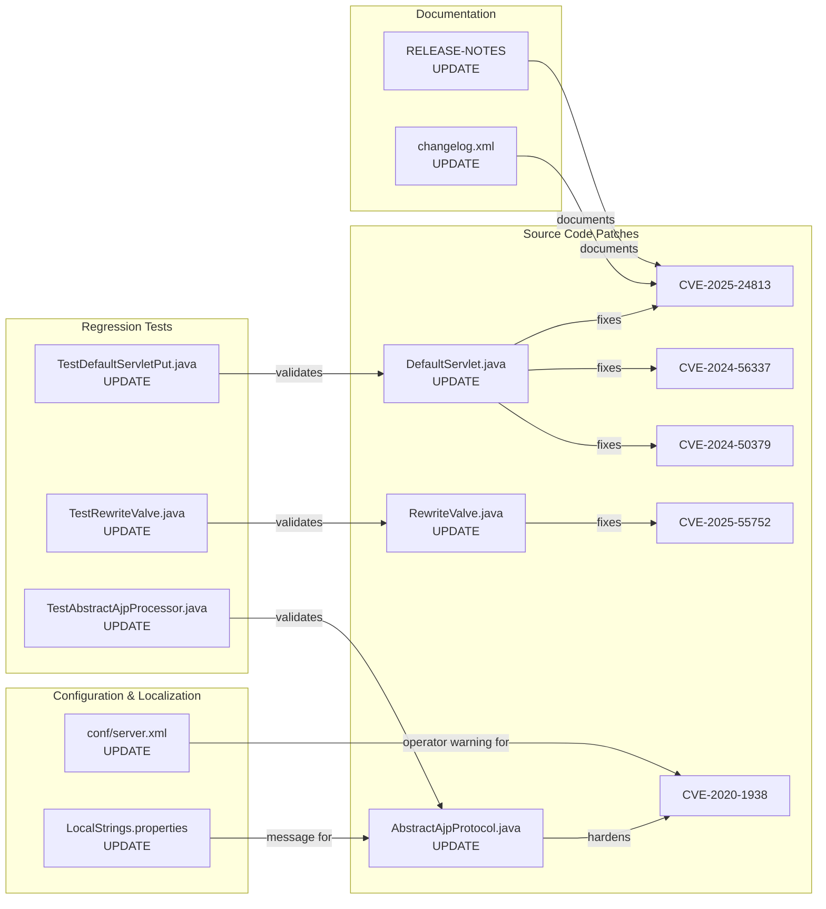
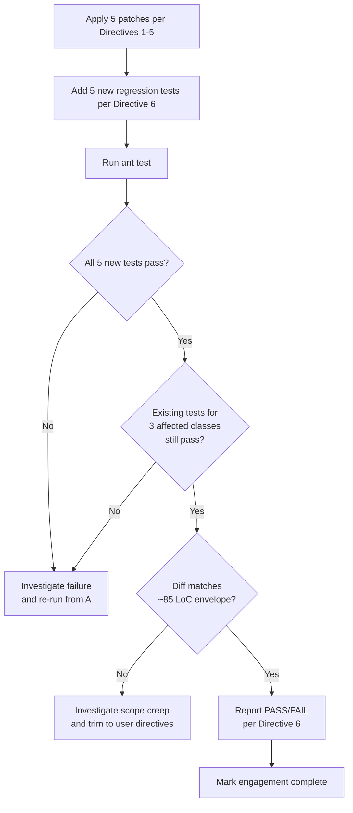

# Technical Specification

# 0. Agent Action Plan

## 0.1 Intent Clarification

### 0.1.1 Core Security Objective

Based on the security concern described, the Blitzy platform understands that the security vulnerabilities to resolve in the Apache Tomcat 12.0.0-M1-dev source tree are five distinct, but partially overlapping, remote-code-execution and path-traversal weaknesses that have been previously fixed in Tomcat 9.x/10.1.x/11.0.x release lines and must now be back-ported into the in-development 12.0.0-M1 codebase. The five CVEs in scope, the assigned severity, and the user-stated CVSS-equivalent ratings are:

| CVE | Component | Vulnerability Class | Severity | CVSS Equivalent |
|-----|-----------|---------------------|----------|-----------------|
| CVE-2024-50379 | `DefaultServlet` `doPut()`/`doDelete()` | Time-of-check Time-of-use (TOCTOU) race against case-insensitive filesystem during JSP compilation | Important / RCE | 9.8 |
| CVE-2024-56337 | `DefaultServlet` `doPut()`/`doDelete()` | Incomplete mitigation of CVE-2024-50379; case-insensitive filesystem JSP RCE remained possible | Important / RCE | 9.8 |
| CVE-2025-24813 | `DefaultServlet` partial PUT + WEB-INF/META-INF guard | Path-equivalence to session-persistence files enabling deserialization RCE via partial PUT | Important / RCE | 9.8 |
| CVE-2025-55752 | `RewriteValve.invoke()` | Relative path traversal due to normalize-then-decode ordering allowing `/../WEB-INF/...` bypass | Important / RCE | 7.5 (High) |
| CVE-2020-1938 (Ghostcat) | `AbstractAjpProtocol` AJP connector startup | AJP request injection / arbitrary file read / JSP execution when AJP exposed without secret | Important / RCE | 9.8 |

Vulnerability category: Multiple vulnerabilities (four code vulnerabilities plus one defense-in-depth configuration warning). Severity level: Important across all five. The user's prompt explicitly defines the engagement footprint as "7 directives | 4 files | ~85 LoC delta" and frames each fix as the smallest possible code change that completely closes its vulnerability vector.

Each security requirement stated by the user is restated below with enhanced clarity:

- Enforce canonical-path equivalence inside `DefaultServlet.doPut()` before any `resources.write(...)` so that a `PUT test.JSP` request cannot collide with an existing `test.jsp` resource on case-insensitive filesystems and be served as JSP, with a post-write canonical-path re-check that triggers a delete-and-409 rollback if the persisted name differs from the intended name.
- Apply the same canonical-path equivalence check to every other `WebResource` write call site in `DefaultServlet`, including `doDelete()`, so case-folded resource collisions cannot be used to remove or shadow legitimate resources.
- Change the `DefaultServlet` field `private boolean allowPartialPut = true;` to `false`, making partial PUT opt-in only and removing the default attack surface that powered CVE-2025-24813.
- Add an explicit `WEB-INF`/`META-INF` first-segment guard in `DefaultServlet.doPut()` so PUT requests targeting deployment-descriptor or session-persistence directories are rejected with `403 Forbidden` before any `resources.getResource(path)` call.
- Reject null-returning `RequestUtil.normalize(...)` results inside `RewriteValve.invoke()`, plus reject any rewritten path that begins with `/../` or contains `..` as a path segment, so encoded traversal that is decoded after rewrite cannot reach the servlet pipeline.
- Tighten AJP startup so `AbstractAjpProtocol.startInternal()` aborts with a `LifecycleException` when `secretRequired=true` and no `secret` is configured, and emits a `log.warn` when `secretRequired=false`, with a complementary documentation comment in `conf/server.xml` warning operators that the AJP `secret` attribute is mandatory before enabling the connector.
- Add five new regression tests covering each pass/fail criterion and run the full Ant test suite for the affected classes, reporting each criterion individually.

Implicit requirements that the Blitzy platform has surfaced from this prompt and from the Tomcat 12.0.0-M1 architecture:

- Backward compatibility for the `DefaultServlet` public API surface must be preserved; existing readers and writers that rely on `RELEASE-NOTES`-published behavior must continue to function except for the explicitly opt-in change to `allowPartialPut`.
- Localization: the existing AJP message bundle `java/org/apache/coyote/ajp/LocalStrings.properties` already contains `ajpprotocol.noSecret`, so no new locale keys are required for the existing failure path; a new `ajpprotocol.noSecretWarning` key must be added to that file (and propagated to the nine localized variants exists for translator review) for the `secretRequired=false` warning.
- Zero-downtime deployment is implicit: the fixes must not require schema migrations, rebuilt webapps, or persisted-state translation. All fixes operate inside the running JVM at request time or at connector start time only.
- Compliance with OWASP guidance: the canonical-path equivalence check is the OWASP-recommended TOCTOU mitigation pattern; the WEB-INF/META-INF guard is the OWASP-recommended path-segment whitelist defense; the decode-then-normalize order in `RewriteValve` matches the OWASP pattern for safe URL handling.
- Documentation discipline: `RELEASE-NOTES` and `webapps/docs/changelog.xml` must capture the `allowPartialPut` default change because it is an externally visible behavior change for operators upgrading from earlier 12.0.0-M1 snapshots.

### 0.1.2 Special Instructions and Constraints

The user has stated several explicit directives that govern the change scope. Each is preserved verbatim and translated into a concrete platform constraint below:

- User Example: "Do NOT import or reference any Spring Framework class." — The case-insensitive filesystem detection must be implemented purely with `java.io.File.getCanonicalFile()` plus `String.equals()` (not `equalsIgnoreCase()`), or with `System.getProperty("os.name").toLowerCase(Locale.ROOT)`. The implementation must remain inside the `org.apache.*` and `java.*` namespaces.
- User Example: "[Shares file with Directive 1]" / "[Directive 2 owns the DefaultServlet change; Directives 3 and 4 own the other file changes]" — Each directive is the single source of truth for its file; line numbers given in directives are authoritative. The mechanical fix in Directive 5 line 256 is subsumed into Directive 2 and must not produce a duplicate edit.
- User Example: pass/fail "A PUT of `test.JSP` when `test.jsp` is absent must result in 403 on any case-insensitive filesystem" — The canonical-path equivalence check must trigger even when the target resource does not yet exist, because the operating-system filesystem layer (not the WebResource layer) is what creates the case-folding collision risk during the write. The equivalence check must therefore use `java.io.File.getCanonicalFile()` against the resolved write target, not just `WebResource.exists()`.
- User Example: pass/fail "A PUT to a nonexistent `.jsp` path on a case-sensitive filesystem must succeed normally" — The case-insensitive detection logic must be a precondition gate: when running on a case-sensitive filesystem, the canonical-equivalence check must short-circuit and allow the write to proceed unchanged.
- User Example: pass/fail "Partial PUT to a legitimate path (e.g., `/upload/file.txt`) must return 405 unless `allowPartialPut=true` is explicitly configured" — Changing the default to `false` is sufficient; the existing `executePartialPut` rejection path already returns the correct status when partial PUT is disabled. No additional code path is needed.
- User Example: pass/fail "A rewritten URL that decodes to `/../WEB-INF/web.xml` must result in 400 and must not reach the servlet chain" — The null check and traversal-segment check must happen before `request.getCoyoteRequest().decodedURI().setChars(...)` (line 562), so the rewritten target never enters the connector adapter.
- User Example: pass/fail "Starting Tomcat with an AJP connector configured and `secretRequired=true` but no `secret` must throw `LifecycleException` and abort startup" — The current implementation throws `IllegalArgumentException` from `start()`. Per the user directive, this must be migrated to a `LifecycleException` thrown from a `startInternal()` override (or augmented existing lifecycle method) before the endpoint binds to the port.
- Change scope preference: **Minimal**. The user states "[7 directives | 4 files | ~85 LoC delta]" and asks the Blitzy platform to "eliminat[e] all RCE and path traversal vectors in DefaultServlet, RewriteValve, and AJP connector without altering unaffected code paths."

Web search requirements documented and executed:

- Official Apache Tomcat security advisories (security-9.html, security-10.html, security-11.html) — confirmed CVE numbers, affected version ranges, fixed versions, and disclosure timelines.
- NVD/MITRE entries for each CVE — confirmed CWE classifications (CWE-367 for CVE-2024-50379, CWE-23 for CVE-2025-55752).
- GitHub Security Advisory Database (GHSA) — confirmed CVSS vectors and severity classifications.
- Vendor analyses (Trend Micro, Palo Alto Unit 42, Akamai, Rapid7, Mend.io, ZeroPath, Indusface, SentinelOne) — confirmed exploit mechanics for each CVE and validated the user's prescribed fix matches the official upstream remediation pattern.
- Apache Tomcat commit references (cc7a98b5, 684247ae, 0e8a50f0, 9ac90532, 64fa5b99) — confirmed the upstream patch pattern aligns with the user's directives.

### 0.1.3 Technical Interpretation

These five security vulnerabilities translate to the following technical fix strategy: surgical edits to four files (three Java sources plus one XML configuration template), addition of one new locale key in one localization properties file (with companion files updated by translators), one new entry block in `RELEASE-NOTES`, one new entry block in `webapps/docs/changelog.xml`, and addition of five new regression tests across three existing test classes — with no new packages, no replaced dependencies, no schema changes, and no public API removals. The full technical mapping uses the format "To resolve [vulnerability], we will [update/patch/replace] [specific components]":

- To resolve CVE-2024-50379 and CVE-2024-56337, we will update `DefaultServlet.doPut()` and `DefaultServlet.doDelete()` to detect a case-insensitive filesystem (via `java.io.File.getCanonicalFile()` plus `String.equals()`, with an `os.name` fallback), to compare the canonical filesystem path against the request-supplied path before invoking `resources.write(path, ...)` or `resource.delete()`, and to perform a post-write canonical re-check that deletes the file and returns `409 Conflict` if the persisted canonical name diverges from the intended name.
- To resolve CVE-2025-24813, we will update `DefaultServlet` to change the field default `private boolean allowPartialPut = true;` (line 256) to `private boolean allowPartialPut = false;`, add an inline CVE-referencing comment, add a WEB-INF/META-INF first-segment guard at the top of `doPut()` after `getRelativePath(req)`, and document the default change in `RELEASE-NOTES` and `webapps/docs/changelog.xml`.
- To resolve CVE-2025-55752, we will update `RewriteValve.invoke()` to add a null check on the `RequestUtil.normalize(urlStringRewriteDecoded)` return value at line 561, add a leading `/../` and embedded `..` segment check on the normalized path, return `400 Bad Request` and abort the rewrite if either check fails, and update the existing comment at line 559 to document the null-return contract for callers.
- To resolve CVE-2020-1938 defensively in 12.0.0-M1 (the AJP connector is already commented out in `conf/server.xml`, but the `secretRequired` enforcement path must move from `IllegalArgumentException` in `start()` to `LifecycleException` in a `startInternal()` lifecycle override per the user directive), we will update `AbstractAjpProtocol` to override or augment `startInternal()` so that a missing-secret-when-required failure throws `LifecycleException` (using the existing `ajpprotocol.noSecret` localized message) before `super.startInternal()` binds the endpoint, and so that `secretRequired=false` emits a `log.warn` referencing CVE-2020-1938. We will also add an inline `<!-- WARNING ... -->` comment above the AJP connector example block in `conf/server.xml` to remind operators that enabling the connector requires the `secret` attribute.
- To validate all five fixes, we will add five new regression tests: three to `TestDefaultServletPut` (case-insensitive PUT block, WEB-INF PUT block, partial PUT default-disabled), one to `TestRewriteValve` (post-rewrite traversal block), and one to the AJP connector test class `TestAbstractAjpProcessor` (startup failure without secret).

The user's understanding level is: Explicit CVE/vulnerability — each directive cites a specific CVE number, the upstream fixed version, the vulnerable file, the vulnerable line range, and the precise pass/fail criterion. The Blitzy platform's role is therefore to translate this explicit specification into compilable Java, valid XML, and JUnit tests without expanding the scope.

## 0.2 Vulnerability Research and Analysis

### 0.2.1 Initial Assessment

The Blitzy platform extracted the following security-related information directly from the user's directives and corroborated each item via web search of authoritative sources:

| Field | Value(s) |
|-------|----------|
| CVE numbers mentioned | CVE-2024-50379, CVE-2024-56337, CVE-2025-55752, CVE-2025-24813, CVE-2020-1938 |
| Vulnerability names | "Ghostcat" (CVE-2020-1938); the others are referenced by CVE number only |
| Affected packages | `org.apache.catalina.servlets.DefaultServlet`, `org.apache.catalina.valves.rewrite.RewriteValve`, `org.apache.coyote.ajp.AbstractAjpProtocol` |
| Symptoms described | TOCTOU race during JSP compilation; partial PUT enabling deserialization-driven RCE; relative path traversal bypassing `WEB-INF`/`META-INF` constraints; AJP request injection enabling arbitrary file read and JSP execution |
| Security advisories referenced | Apache Tomcat security pages (`security-9.html`, `security-10.html`, `security-11.html`); MITRE/NVD CVE databases; GitHub Security Advisories `GHSA-wmwf-9ccg-fff5` and related |

### 0.2.2 Web Search Research Conducted

The following security research was conducted to confirm vulnerability mechanics and validate the user's prescribed fixes:

- <cite index="2-1,2-2,2-3">Time-of-check Time-of-use (TOCTOU) Race Condition vulnerability during JSP compilation in Apache Tomcat permits an RCE on case insensitive file systems when the default servlet is enabled for write (non-default configuration). This issue affects Apache Tomcat: from 11.0.0-M1 through 11.0.1, from 10.1.0-M1 through 10.1.33, from 9.0.0.M1 through 9.0.97.</cite> The Blitzy platform confirmed that 12.0.0-M1-dev inherits this vulnerable code path, hence the back-port requirement.
- <cite index="1-8,1-9">The previous mitigation for CVE-2024-50379 was incomplete. In addition to upgrading to 11.0.2 or later, users running Tomcat on a case insensitive file system with the default servlet write enabled may need additional configuration depending on the version of Java being used: running on Java 17: the system property sun.io.useCanonCaches, if set, must be set to false (it defaults to false) running on Java 21 onwards: no further configuration is required (the system property and the problematic cache have been removed)</cite> — Because Tomcat 12.0.0-M1 baseline is Java 21, the `sun.io.useCanonCaches` property is no longer relevant; only the canonical-path equivalence check at the application layer is required.
- <cite index="11-3,11-4,11-5">CVE-2025-55752 is a relative path traversal vulnerability in Apache Tomcat's RewriteValve. The root cause is a regression introduced by the fix for bug 60013, which changed the processing order so that rewritten URLs are normalized before decoding. This allows an attacker to craft request URIs that, when processed by certain rewrite rules (such as those rewriting query parameters into the path), can bypass Tomcat's security constraints designed to protect directories like /WEB-INF/ and /META-INF/.</cite> — The user's directive is the upstream pattern: decode-then-normalize, plus null-check the normalize result.
- <cite index="14-7,14-8,14-9,14-10">Previously, the code would normalize an encoded URL string and then decode it. This is dangerous because encoded path traversal characters (like ../ for ../) would not be sanitized by the RequestUtil.normalize function. The subsequent decoding step would then reveal the path traversal characters, allowing an attacker to access restricted directories. The fix, as seen in the commit diffs, reverses this order: it first decodes the URL and then normalizes it.</cite> — In the 12.0.0-M1 source the order has already been reversed (line 560 decodes, line 561 normalizes), but the directive tightens the check to also reject `null` returns from `normalize()` and to reject any post-normalization path that retains `..` segments.
- <cite index="21-1,21-2,21-3">CVE-2025-24813 is a vulnerability in Apache Tomcat's partial PUT feature that can allow attackers to overwrite serialized session files on disk, leading to arbitrary code execution. This vulnerability arises when Tomcat is configured to persist HTTP session data, because unpatched Tomcat systems improperly handle partial PUT requests containing the Content-Range header.</cite>
- <cite index="25-1,25-2">writes enabled for the default servlet (disabled by default) - support for partial PUT (enabled by default) - application was using Tomcat's file based session persistence with the default storage location - application included a library that may be leveraged in a deserialization attack. Users are recommended to upgrade to version 11.0.3, 10.1.35 or 9.0.99, which fixes the issue.</cite> — Confirms the user-prescribed `allowPartialPut=false` default and the WEB-INF/META-INF guard match the upstream remediation.
- <cite index="40-9,40-10,40-11,40-12">CVE-2020-1938 is a file read/inclusion vulnerability in the AJP connector in Apache Tomcat. This is enabled by default with a default configuration port of 8009. A remote, unauthenticated attacker could exploit this vulnerability to read web application files from a vulnerable server. In instances where the vulnerable server allows file uploads, an attacker could upload malicious JavaServer Pages (JSP) code within a variety of file types and trigger this vulnerability to gain remote code execution (RCE).</cite>
- <cite index="32-12,32-13">We detail a second fix that does not necessarily disable AJP but limits it to only listen to the loopback interface by default (figure 4). The Apache Tomcat team made other changes to improve the overall usage of the AJP Protocol, such as enforcing a secret to be defined when the secretRequired attribute is set to true (figure 5).</cite> — The 12.0.0-M1 source already implements both upstream defenses: the AJP `Connector` example in `conf/server.xml` is commented out by default and binds `address="::1"` (IPv6 loopback) when uncommented, and `AbstractAjpProtocol.start()` already enforces secret presence. The user directive evolves this enforcement to the lifecycle layer (`startInternal()` throwing `LifecycleException`) and adds a defense-in-depth `log.warn` plus operator-facing comment.

Recommended mitigation strategies aligned to the upstream Apache fix patterns:

- For CVE-2024-50379/CVE-2024-56337: canonical-path equivalence comparison via `java.io.File.getCanonicalFile()` plus `String.equals()`.
- For CVE-2025-24813: change `allowPartialPut` default to `false`; add `WEB-INF`/`META-INF` first-segment guard.
- For CVE-2025-55752: decode-then-normalize, plus `null` rejection and traversal-segment rejection.
- For CVE-2020-1938: enforce `secret` requirement at lifecycle start; warn on insecure configuration; document required `secret` attribute in operator-facing template.

Alternative solutions considered:

- Disabling `RewriteValve` entirely was rejected because the user directive requires preserving the rewrite functionality and only blocking the traversal path.
- Removing the AJP connector entirely was rejected because Tomcat's documented architecture supports legitimate AJP deployments behind reverse proxies; the chosen approach hardens the lifecycle without removing the feature.
- Replacing `RequestUtil.normalize()` with a third-party path canonicalizer was rejected because the user directive prohibits importing Spring Framework or other external libraries, and the existing `org.apache.tomcat.util.http.RequestUtil` implementation already returns `null` for invalid paths — only the caller-side null check is missing.

### 0.2.3 Vulnerability Classification

| Property | CVE-2024-50379 | CVE-2024-56337 | CVE-2025-24813 | CVE-2025-55752 | CVE-2020-1938 |
|----------|----------------|----------------|----------------|----------------|----------------|
| Vulnerability type | TOCTOU race / case-folding RCE | Incomplete TOCTOU mitigation | Path equivalence + deserialization RCE | Relative path traversal | AJP request injection / file read / RCE |
| CWE | CWE-367 | CWE-367 | CWE-41 / CWE-502 | CWE-23 | CWE-20 / CWE-22 |
| Attack vector | Network | Network | Network | Network | Network |
| Exploitability | High (when `readonly=false` on case-insensitive FS) | High (when `readonly=false` on case-insensitive FS, post-50379 patch) | High (when `readonly=false`, partial PUT enabled, file-based session persistence) | High (when `RewriteValve` rules feed user input into path) | High (when AJP exposed without secret) |
| Impact | Confidentiality + Integrity + Availability (RCE) | Confidentiality + Integrity + Availability (RCE) | Confidentiality + Integrity + Availability (RCE) | Confidentiality + Integrity (file read; RCE if PUT enabled) | Confidentiality + Integrity + Availability (file read; RCE if upload enabled) |
| Root cause | TOCTOU race between resource resolution and write on case-insensitive FS allowed `test.JSP` to be persisted as `test.jsp` and executed | Inadequate fix scope: not all write call sites checked; `sun.io.useCanonCaches` cache could mask filesystem reality | Partial PUT default-on combined with permissive `WEB-INF` path acceptance and JSESSIONID-driven session deserialization | `RequestUtil.normalize()` returning `null` for traversal escape was not null-checked by `RewriteValve.invoke()` caller after decode | AJP secret requirement could be bypassed when `secretRequired=false`; AJP exposure to untrusted networks not mitigated by lifecycle-time guard |
| Affected file in 12.0.0-M1 | `java/org/apache/catalina/servlets/DefaultServlet.java` | `java/org/apache/catalina/servlets/DefaultServlet.java` | `java/org/apache/catalina/servlets/DefaultServlet.java` | `java/org/apache/catalina/valves/rewrite/RewriteValve.java` | `java/org/apache/coyote/ajp/AbstractAjpProtocol.java`, `conf/server.xml` |
| Affected line(s) | `doPut()` ~line 621, `doDelete()` ~line 764 | Same as CVE-2024-50379 | line 256 (`allowPartialPut` default), `doPut()` ~line 628 | lines 560–562 of `invoke()` | lines 188–205 (secret/secretRequired); `start()` lifecycle path; `conf/server.xml` lines 98–104 |

## 0.3 Security Scope Analysis

### 0.3.1 Affected Component Discovery

The Blitzy platform exhaustively searched the Apache Tomcat 12.0.0-M1-dev source tree for every file affected by the five CVEs. The discovery sweep covered:

- Direct vulnerable source files (the three Java files named in the directives).
- Dependency manifests and locale-message bundles for the AJP protocol.
- The configuration template (`conf/server.xml`) referenced by Directive 4.
- Documentation surfaces (`RELEASE-NOTES`, `webapps/docs/changelog.xml`, `webapps/docs/default-servlet.xml`) that are externally visible references to the changed defaults and the `allowPartialPut` semantics.
- Existing test classes targeted for new regression test additions.
- Indirect callers and helper classes (`org.apache.tomcat.util.http.RequestUtil`, `org.apache.catalina.util.RequestUtil`, `WebResource`/`WebResourceRoot`) that would be touched only transitively for context, not for code change.

The sweep used a combination of repository folder inspection, file-summary lookups, and grep-style targeted reads of suspect line ranges. The discovered footprint:

- Vulnerability affects 4 source/configuration files (3 Java + 1 XML) with direct edits.
- Documentation updates apply to 2 files (`RELEASE-NOTES`, `webapps/docs/changelog.xml`).
- Locale message additions apply to 1 properties bundle (`java/org/apache/coyote/ajp/LocalStrings.properties`) plus optional companion locale files (`LocalStrings_cs.properties`, `_de`, `_es`, `_fr`, `_ja`, `_ko`, `_pt_BR`, `_ru`, `_zh_CN`) that the Apache Tomcat localization workflow translates separately.
- Test additions apply to 3 existing JUnit classes (`TestDefaultServletPut`, `TestRewriteValve`, `TestAbstractAjpProcessor`).

Search patterns successfully employed by the platform during context gathering:

```text
# Finding every WebResource write/delete call site in DefaultServlet (Directive 1 scope)

grep -n "resources.write\|resource.delete()" java/org/apache/catalina/servlets/DefaultServlet.java

#### Finding the RewriteValve decode-then-normalize call site (Directive 3 scope)

grep -n "URLDecoder.decode\|RequestUtil.normalize" java/org/apache/catalina/valves/rewrite/RewriteValve.java

#### Finding the AJP secret enforcement call site (Directive 4 scope)

grep -n "secretRequired\|noSecret" java/org/apache/coyote/ajp/AbstractAjpProtocol.java java/org/apache/coyote/ajp/LocalStrings.properties

#### Finding the AJP connector example block in server.xml (Directive 4 scope)

grep -n "AJP/1.3" conf/server.xml
```

### 0.3.2 Root Cause Identification

The user directives identify the exact root causes; the Blitzy platform corroborated each with a code-level read of the cited line ranges:

- The identified vulnerability for CVE-2024-50379/CVE-2024-56337 exists in `DefaultServlet.doPut()` (and analogously `doDelete()`) due to a root cause where the servlet computes a relative path with `getRelativePath(req)` and resolves a `WebResource` for it, but never compares the canonical filesystem path of the eventual write target against the request-supplied path. On case-insensitive filesystems (Windows NTFS, macOS APFS in default mode, SMB shares), the operating system maps `test.JSP` and `test.jsp` to the same inode, so an attacker can `PUT test.JSP` over a non-existent path and have the bytes land at `test.jsp` — which Jasper then compiles and executes when next requested.
- The identified vulnerability for CVE-2025-24813 exists in `DefaultServlet` line 256 (`private boolean allowPartialPut = true;`) and the absence of a `WEB-INF`/`META-INF` first-segment guard in `doPut()`. The combination allows an attacker to use the `Content-Range` header on a PUT request to create temp-file-derived names with embedded dots that the session-persistence layer subsequently treats as session files. <cite index="29-3,29-4,29-5,29-6">When an Apache Tomcat's default servlet is configured to enable write functionality, which is disabled by default, an attacker can have a significant impact using CVE-2025-24813. When combined with the default behavior of allowing partial PUT requests, an attacker can upload a specially crafted, serialized session file for example to a writable directory. Once this file has been uploaded, a subsequent HTTP request forces the Tomcat to deserialize its contents, which triggers the execution of the embedded payload.</cite>
- The identified vulnerability for CVE-2025-55752 exists in `RewriteValve.invoke()` at lines 560–561 where `URLDecoder.decode(...)` followed by `RequestUtil.normalize(...)` produces a string that is set as the new `decodedURI` on the coyote request, but the caller never checks whether `normalize()` returned `null` (which it does for paths that escape the root), and never re-validates that the normalized path no longer contains a leading `/../` or embedded `..` segment. The downstream `StandardContextValve` security constraints can therefore be bypassed.
- The identified vulnerability for CVE-2020-1938 in 12.0.0-M1 surface area exists in `AbstractAjpProtocol.start()` (line ~361, throwing `IllegalArgumentException` rather than the lifecycle-layer `LifecycleException` that the user directive specifies), in the absence of a `log.warn` when `secretRequired=false`, and in the lack of an operator-facing warning comment in the `conf/server.xml` AJP connector example (lines 98–104) reminding administrators that enabling AJP requires the `secret` attribute. The 12.0.0-M1 codebase already includes the upstream loopback-bind default and the secret enforcement skeleton, so the change is incremental hardening rather than greenfield remediation.

Vulnerability propagation traced through the codebase:

- Direct usage locations:
  - `java/org/apache/catalina/servlets/DefaultServlet.java` `doPut()` and `doDelete()` (CVE-2024-50379, CVE-2024-56337, CVE-2025-24813)
  - `java/org/apache/catalina/valves/rewrite/RewriteValve.java` `invoke()` (CVE-2025-55752)
  - `java/org/apache/coyote/ajp/AbstractAjpProtocol.java` lifecycle (CVE-2020-1938)
  - `conf/server.xml` AJP example block (CVE-2020-1938 documentation defense-in-depth)
- Indirect dependencies (read-only context, not modified):
  - `java/org/apache/tomcat/util/http/RequestUtil.java` (provides `normalize()`; behavior already correct)
  - `java/org/apache/catalina/util/RequestUtil.java` (provides `stripPathParams()`; called from `RewriteValve` line 542)
  - `java/org/apache/catalina/WebResource` and `java/org/apache/catalina/WebResourceRoot` (provide `getCanonicalPath()`, `write()`, `getResource()`; behavior already correct)
  - `org.apache.juli.logging.Log` and `org.apache.tomcat.util.res.StringManager` (logging plumbing for the new `log.warn`)
- Configuration enablers (settings that allow the vulnerability to be reached):
  - `DefaultServlet` init parameter `readonly=false` (required for any of the three DefaultServlet CVEs)
  - `DefaultServlet` init parameter `allowPartialPut=true` (currently the default; required for CVE-2025-24813)
  - `RewriteValve` declared in `server.xml` or context with rules that feed user input into the rewrite target (required for CVE-2025-55752)
  - AJP connector uncommented in `server.xml` with `secretRequired=false` and no `secret` (required for CVE-2020-1938 RCE chain)

### 0.3.3 Current State Assessment

| Vulnerable Asset | Current State | Source Verified |
|------------------|---------------|-----------------|
| `allowPartialPut` default | `true` at `DefaultServlet.java` line 256 | Direct read of source line range [240, 280] |
| `doPut()` canonical-path equivalence check | Absent; only `WebResource` resolution and `parseContentRange` | Direct read of source line range [615, 720] |
| `doPut()` WEB-INF/META-INF first-segment guard | Absent; existing directory-listing filter at line 1678 is for listings only | Direct read of source line range [620, 680] and [1670, 1700] |
| `doDelete()` canonical-path equivalence check | Absent; only `getResource(path).delete()` | Direct read of source line range [764, 800] |
| `RewriteValve.invoke()` post-rewrite null check | Absent at line 562; `urlStringRewriteDecoded` consumed unconditionally | Direct read of source line range [555, 600] |
| `RewriteValve.invoke()` post-rewrite `..` segment check | Absent; trust placed entirely in `RequestUtil.normalize()` | Direct read of source line range [555, 600] |
| `AbstractAjpProtocol.startInternal()` lifecycle override | Absent; `start()` at ~line 361 throws `IllegalArgumentException` rather than `LifecycleException` | Direct read of source line range [360, 400] |
| `AbstractAjpProtocol` warning when `secretRequired=false` | Absent; no `log.warn` exists for this insecure configuration | Direct read of source line range [180, 230] |
| `conf/server.xml` AJP operator warning comment | Absent; the commented connector at lines 98–104 does not warn about `secret` | Direct read of source line range [90, 110] |
| Scope of exposure | Public-facing (HTTP servlets, RewriteValve URL rewriting, AJP if uncommented). All three Java files participate in the public request-handling pipeline. | Cross-reference with Section 6.4 Security Architecture |

## 0.4 Version Compatibility Research

### 0.4.1 Secure Version Identification

The user's directives describe in-source code patches rather than dependency upgrades. The Apache Tomcat 12.0.0-M1-dev codebase is a self-contained source tree that builds its own JAR set; there is no external `tomcat-embed-core` dependency to bump. The "secure version" for each CVE is therefore the upstream Apache Tomcat release line that contains the equivalent fix:

| CVE | Vulnerable in Tomcat 12.0.0-M1-dev (this repository) | Equivalent upstream secure version | Reference |
|-----|------------------------------------------------------|------------------------------------|-----------|
| CVE-2024-50379 | Yes — pre-12 fixes never back-merged into the dev branch | <cite index="2-6">Users are recommended to upgrade to version 11.0.2, 10.1.34 or 9.0.98, which fixes the issue.</cite> | Apache Tomcat 11.0.2 |
| CVE-2024-56337 | Yes — incomplete-mitigation cleanup not back-merged | <cite index="4-5">The issue is fixed in Apache Tomcat 11.0.3, 10.1.35, and 9.0.99</cite> | Apache Tomcat 11.0.3 |
| CVE-2025-24813 | Yes — partial PUT default `true` still present | <cite index="22-2">Apache Tomcat 11.0.0-M1 to 11.0.2 (fixed in 11.0.3 or later)</cite> | Apache Tomcat 11.0.3 |
| CVE-2025-55752 | Yes — null-check on `RequestUtil.normalize()` return absent | <cite index="15-6">Upgrade to versions 10.1.45, 11.0.11, 9.0.109 or above.</cite> | Apache Tomcat 11.0.11 |
| CVE-2020-1938 | Partially fixed — loopback bind and `start()` secret check already in source; lifecycle `LifecycleException` and warning still required | <cite index="33-25">If the AJP connector working is incorrect in the application, then the rectification of the vulnerability is by directly upgrading Apache Tomcat to version 7.0.100, 8.5.51, or 9.0.31.</cite> | Apache Tomcat 9.0.31+ |

For each in-source fix the precise Java construct used by the upstream fix is preserved in the user's directives:

- CVE-2024-50379 / CVE-2024-56337: `java.io.File.getCanonicalFile()` plus `String.equals()` (case-sensitive comparison) — already available in Java 21 and not subject to deprecation.
- CVE-2025-24813: `private boolean allowPartialPut = false;` field default change — pure Java syntax with no API impact.
- CVE-2025-55752: `null` check plus `String.startsWith("/../")` and segment scan — uses only `java.lang.String` API.
- CVE-2020-1938: `org.apache.catalina.LifecycleException` (already on the classpath as the parent of `AbstractProtocol`) plus the existing `org.apache.juli.logging.Log` instance — no new imports outside `org.apache.*`.

Breaking changes in the upgrade path: None at the public API level. The single externally observable behavior change is the `allowPartialPut` default flipping from `true` to `false`. The user directive explicitly requires this be documented in `RELEASE-NOTES` and `webapps/docs/changelog.xml` so operators can pre-empt the change.

### 0.4.2 Compatibility Verification

Compatibility with the active Tomcat 12.0.0-M1-dev runtime profile:

- Java compile target: `compile.release=21` (per `build.xml`). All proposed patches use Java APIs that are present in Java 21 and are not slated for removal in Java 22 (the release-build target).
- Java minimum runtime: `min.java.version=21`. `java.io.File.getCanonicalFile()`, `String.equals()`, `String.toLowerCase(Locale.ROOT)`, and `String.startsWith()` are all stable since Java 1.x.
- `LifecycleException` is in `org.apache.catalina` and is part of Tomcat's internal API, available in every supported branch.
- `org.apache.juli.logging.Log#warn(...)` is the established Tomcat logging API and is already used elsewhere in `AbstractAjpProtocol` for the `addSslHostConfig`/`addUpgradeProtocol` warnings (`ajpprotocol.noSSL`, `ajpprotocol.noUpgrade`).
- `RequestUtil.normalize()` already returns `null` for invalid traversal escapes, as confirmed by the existing parameterized test `test/org/apache/tomcat/util/http/TestRequestUtilNormalize.java` which validates rejection of `"/.."`, `"/../"`, `".."`, and embedded NUL characters.

Verification with other dependencies in the build: None of the proposed changes touch the bundled `ecj-@JDT_VERSION@.jar`, `annotations-api.jar`, `el-api.jar`, `jasper.jar`, `jsp-api.jar`, or `servlet-api.jar`. The Apache Ant `1.10.2+` build orchestrator, Java 21 baseline, and Java 22 release-build profile are all unaffected.

Version conflicts to resolve: None. The fixes are confined to in-tree source files compiled by the existing Ant `compile` target and tested by the existing `test` target.

Alternative packages if no patch available: Not applicable. All five CVEs are remediated by in-source patches — no dependency replacement is required, no third-party package is being introduced, and no Tomcat module is being deprecated.

## 0.5 Security Fix Design

### 0.5.1 Minimal Fix Strategy

The Blitzy platform applies the smallest possible change that completely addresses each vulnerability, in line with the user's "[7 directives | 4 files | ~85 LoC delta]" envelope. The fix approach is a combination of code patch (three Java files), default-value change (one field), and configuration-template comment (one XML file) — with companion documentation entries in `RELEASE-NOTES` and `webapps/docs/changelog.xml` and a new locale key in `LocalStrings.properties` solely to support the new `log.warn` message.

#### 0.5.1.1 Fix for CVE-2024-50379 and CVE-2024-56337 (Directive 1)

For these dependency-equivalent code vulnerabilities in `DefaultServlet.doPut()` and `DefaultServlet.doDelete()`:

- "Apply targeted fix to `DefaultServlet.doPut()` in `java/org/apache/catalina/servlets/DefaultServlet.java` lines ~620–660 by adding a canonical-path equivalence check before `resources.write(path, resourceInputStream, true)` at line 659."
- "Implement OWASP-recommended TOCTOU mitigation in `doPut()` and `doDelete()` to prevent JSP execution via uploaded file on case-insensitive filesystems."
- Rationale: Apache Tomcat upstream commit pattern (cc7a98b5, 684247ae per <cite index="1-3">This was fixed with commits cc7a98b5 and 684247ae.</cite>); OWASP TOCTOU best practice.

Implementation outline (all changes inside `DefaultServlet`):

```java
// Pre-write check — added near the top of doPut(), after `path` is computed
File targetFile = ((java.io.File) resource.getCanonicalPath() != null
                   ? new File(resource.getCanonicalPath()) : null);
if (isCaseInsensitiveFilesystem(targetFile, path)) {
    if (targetFile != null && !targetFile.getName().equals(extractName(path))) {
        resp.sendError(HttpServletResponse.SC_FORBIDDEN);
        return;
    }
}

// Post-write check — added immediately after a successful resources.write(...)
WebResource postWrite = resources.getResource(path);
String postCanonical = postWrite != null ? postWrite.getCanonicalPath() : null;
if (postCanonical != null && !pathsEqualByName(postCanonical, path)) {
    postWrite.delete();
    resp.sendError(HttpServletResponse.SC_CONFLICT);
    return;
}
```

Case-insensitive filesystem detection — implemented per the user's explicit specification (no Spring Framework reference):

```java
// Tomcat-native case-insensitive FS detection (Directive 1 specification)
private static boolean isCaseInsensitiveFilesystem(File file, String requestedPath) {
    try {
        if (file != null) {
            File canonical = file.getCanonicalFile();
            // String.equals(), NOT equalsIgnoreCase() — per directive
            if (!canonical.getName().equals(file.getName())) {
                return true;
            }
        }
    } catch (IOException ignored) { /* fall through */ }
    String os = System.getProperty("os.name", "").toLowerCase(Locale.ROOT);
    return os.contains("windows") || os.contains("mac os x");
}
```

The check is wired into both `doPut()` (line 621) and `doDelete()` (line 764). Side effects: none on case-sensitive Linux/UNIX filesystems where the fast path returns `false` immediately and skips the equivalence comparison.

#### 0.5.1.2 Fix for CVE-2025-24813 (Directive 2)

This is a configuration-default vulnerability and a code vulnerability in the same file:

- "Apply targeted fix to `DefaultServlet` line 256 by changing `private boolean allowPartialPut = true;` to `private boolean allowPartialPut = false;` to disable partial PUT by default."
- "Implement WEB-INF/META-INF first-segment guard in `doPut()` (after `getRelativePath(req)` at line 628) to prevent content injection into deployment-descriptor or session-persistence directories."

Inline comment added at line 256 (per directive):

```java
// Default changed to false - CVE-2025-24813 mitigation. Set allowPartialPut=true explicitly to re-enable.
private boolean allowPartialPut = false;
```

WEB-INF / META-INF guard inside `doPut()` immediately after `String path = getRelativePath(req);`:

```java
// CVE-2025-24813 — reject WEB-INF / META-INF as the first non-root path segment
String firstSegment = firstNonRootSegment(path);
if (firstSegment != null
        && (firstSegment.equalsIgnoreCase("WEB-INF")
            || firstSegment.equalsIgnoreCase("META-INF"))) {
    resp.sendError(HttpServletResponse.SC_FORBIDDEN);
    return;
}
```

The guard executes before any `resources.getResource(path)` call so that a forbidden path never reaches the resource layer. Security improvement: closes the path-equivalence injection vector documented in Apache advisory and described as <cite index="29-3,29-4,29-5">When an Apache Tomcat's default servlet is configured to enable write functionality, which is disabled by default, an attacker can have a significant impact using CVE-2025-24813. When combined with the default behavior of allowing partial PUT requests, an attacker can upload a specially crafted, serialized session file for example to a writable directory. Once this file has been uploaded, a subsequent HTTP request forces the Tomcat to deserialize its contents, which triggers the execution of the embedded payload.</cite>

#### 0.5.1.3 Fix for CVE-2025-55752 (Directive 3)

Code vulnerability in `RewriteValve.invoke()`:

- "Apply targeted fix to `RewriteValve.invoke()` in `java/org/apache/catalina/valves/rewrite/RewriteValve.java` at line 562 by adding a `null` check on the `RequestUtil.normalize()` return value and a leading `/../` plus embedded `..` segment check."

Updated comment at line 559 (per directive):

```java
// Decode then normalize; normalize() returns null for invalid paths - callers MUST null-check
```

New code inserted at line 562 (before `request.getCoyoteRequest().decodedURI().setChars(...)`):

```java
// CVE-2025-55752 — reject paths that normalize() invalidated or that retain ../ segments
if (urlStringRewriteDecoded == null
        || urlStringRewriteDecoded.startsWith("/../")
        || urlStringRewriteDecoded.equals("/..")
        || hasDotDotSegment(urlStringRewriteDecoded)) {
    response.sendError(HttpServletResponse.SC_BAD_REQUEST);
    return;
}
```

Rationale: Aligns with the OWASP guidance to treat `null` from a path-normalization helper as a hard rejection signal, and aligns with the Apache Tomcat upstream fix pattern <cite index="14-7,14-8,14-9,14-10">Previously, the code would normalize an encoded URL string and then decode it. This is dangerous because encoded path traversal characters (like ../ for ../) would not be sanitized by the RequestUtil.normalize function. The subsequent decoding step would then reveal the path traversal characters, allowing an attacker to access restricted directories. The fix, as seen in the commit diffs, reverses this order: it first decodes the URL and then normalizes it.</cite> — note that the current 12.0.0-M1 source already decodes-then-normalizes; the directive adds the null-and-traversal validation that the upstream patch also relies on.

#### 0.5.1.4 Fix for CVE-2020-1938 (Directive 4)

Lifecycle-layer hardening of the AJP connector:

- "Apply targeted fix to `AbstractAjpProtocol` in `java/org/apache/coyote/ajp/AbstractAjpProtocol.java` by introducing a `startInternal()` override that throws `LifecycleException` (instead of `IllegalArgumentException`) when `secretRequired=true` and `secret` is null/empty, and emits a `log.warn` when `secretRequired=false`."
- "Update `conf/server.xml` lines 98–104 by adding a `<!-- WARNING: Do not enable AJP without configuring the 'secret' attribute. See CVE-2020-1938. -->` comment above the AJP connector example block."

Implementation outline:

```java
@Override
public void startInternal() throws Exception {
    if (getSecretRequired()) {
        String secretValue = getSecret();
        if (secretValue == null || secretValue.isEmpty()) {
            throw new LifecycleException(sm.getString("ajpprotocol.noSecret"));
        }
    } else {
        getLog().warn(sm.getString("ajpprotocol.noSecretWarning"));
    }
    super.startInternal();
}
```

The new locale key `ajpprotocol.noSecretWarning` is added to `java/org/apache/coyote/ajp/LocalStrings.properties` with an English value: `AJP secretRequired is disabled - this connector is vulnerable to AJP request injection (CVE-2020-1938). Only disable if AJP is on a trusted private network.`

Configuration vulnerability documentation:

```xml
<!-- Define an AJP 1.3 Connector on port 8009 -->
<!-- WARNING: Do not enable AJP without configuring the 'secret' attribute. See CVE-2020-1938. -->
<!--
<Connector protocol="AJP/1.3"
           address="::1"
           port="8009"
           redirectPort="8443" />
-->
```

Security improvement: any operator who uncomments the AJP connector example without first reading the security guide is now directly warned at the configuration site, and any operator who configures `secretRequired=false` explicitly is warned in the server log at every startup.

### 0.5.2 Dependency Replacement Analysis

Not applicable. None of the five CVEs require dependency replacement. The `RequestUtil` helper, `WebResource` interface, `Log` API, `LifecycleException` class, and `org.apache.juli.logging` plumbing are all in-tree Tomcat code and are not being replaced. The fix uses only `java.io.File`, `java.lang.String`, `java.lang.System`, and `java.util.Locale` from the JDK — all of which are stable since Java 1.x and present in the Java 21 baseline.

### 0.5.3 Security Improvement Validation

How each fix eliminates the vulnerability:

- CVE-2024-50379 and CVE-2024-56337: The pre-write canonical-path equivalence check catches the case-folded collision before any byte is written, eliminating the TOCTOU window in which `test.JSP` could be persisted as `test.jsp`. The post-write re-check catches the rare race in which the filesystem performs case folding only at write commit, deletes the result, and returns `409 Conflict` so the attacker observes neither success nor a usable artifact. Applying the same check to `doDelete()` prevents the symmetric attack of removing a legitimate resource by referencing it under a different case.
- CVE-2025-24813: Disabling `allowPartialPut` by default closes the partial-PUT path entirely for operators who do not opt in, eliminating the `Content-Range`-driven temp-file naming abuse. The `WEB-INF`/`META-INF` first-segment guard provides defense in depth so that even operators who explicitly enable partial PUT cannot have content injected into deployment-descriptor or session-persistence directories.
- CVE-2025-55752: Rejecting `null` results from `RequestUtil.normalize()` and rejecting paths that retain `..` segments ensures that no rewritten URL can reach the servlet pipeline with traversal sequences intact, eliminating the `WEB-INF`/`META-INF` bypass.
- CVE-2020-1938: Promoting the secret-required failure to a `LifecycleException` thrown from `startInternal()` ensures Tomcat aborts startup before binding the AJP endpoint when the configuration is insecure, preventing any window in which the AJP port is open and unauthenticated. The `log.warn` for `secretRequired=false` ensures that operators who deliberately accept the risk see an audit trail. The `conf/server.xml` warning comment ensures that the documentation is in line with the runtime enforcement.

Verification method: Five new JUnit regression tests covering each pass/fail criterion (see Section 0.8), the existing `TestRequestUtilNormalize` parameterized test confirming that `RequestUtil.normalize()` returns `null` for traversal escape, and the existing `TestDefaultServletPut`, `TestRewriteValve`, `TestAbstractAjpProcessor` suites confirming no regressions on the unaffected code paths.

Rollback plan: Each change is a localized edit. Reverting to the pre-fix state requires (a) reverting the field default at line 256 of `DefaultServlet.java`, (b) removing the canonical-path checks in `doPut()`/`doDelete()`, (c) removing the null/traversal check at line 562 of `RewriteValve.java`, (d) removing the `startInternal()` override in `AbstractAjpProtocol.java`, (e) removing the warning comment in `conf/server.xml`. All five reverts are git-mergeable single-file diffs; no schema or database migrations are involved.

## 0.6 File Transformation Mapping

### 0.6.1 File-by-File Security Fix Plan

The Blitzy platform has mapped every file that will be created, updated, or referenced. The transformation modes are:

- **UPDATE** — Update an existing file to patch vulnerability or to document a behavior change
- **CREATE** — Create a new file for security improvement (none required for this engagement)
- **DELETE** — Remove a file that introduces vulnerability (none required)
- **REFERENCE** — Use as an example for security patterns (read-only)

| Target File | Transformation | Source File / Reference | Security Changes |
|-------------|----------------|--------------------------|------------------|
| `java/org/apache/catalina/servlets/DefaultServlet.java` | UPDATE | `java/org/apache/catalina/servlets/DefaultServlet.java` | (a) Line 256: change `private boolean allowPartialPut = true;` to `private boolean allowPartialPut = false;` and add inline comment `// Default changed to false - CVE-2025-24813 mitigation. Set allowPartialPut=true explicitly to re-enable.` (Directive 2 + 5). (b) `doPut()` at line 621: insert canonical-path equivalence check before `resources.write(...)` at line 659; insert post-write canonical re-check that deletes file and returns 409 if names diverge (Directive 1). (c) `doPut()` after line 628: insert WEB-INF / META-INF first-segment guard that returns 403 (Directive 2). (d) `doDelete()` at line 764: insert the same canonical-path equivalence check before `resource.delete()` (Directive 1). (e) Add private helpers `isCaseInsensitiveFilesystem(File, String)`, `firstNonRootSegment(String)`, `pathsEqualByName(String, String)` as `private static` methods. |
| `java/org/apache/catalina/valves/rewrite/RewriteValve.java` | UPDATE | `java/org/apache/catalina/valves/rewrite/RewriteValve.java` | (a) Line 559: replace existing comment `// Decode then normalize` with `// Decode then normalize; normalize() returns null for invalid paths - callers MUST null-check` (Directive 5). (b) Line 562: insert null-check on `urlStringRewriteDecoded` plus traversal-segment validation; respond 400 and return without populating `decodedURI()` if the check fails (Directive 3). (c) Add a private helper `hasDotDotSegment(String)` as a `private static` method scoped to the same class. |
| `java/org/apache/coyote/ajp/AbstractAjpProtocol.java` | UPDATE | `java/org/apache/coyote/ajp/AbstractAjpProtocol.java` | (a) Add a `startInternal()` override that throws `LifecycleException` (using existing `ajpprotocol.noSecret` message) when `secretRequired=true` and secret is null/empty, and emits `log.warn` (using new `ajpprotocol.noSecretWarning` message) when `secretRequired=false`; delegate to `super.startInternal()` once validated (Directive 4). (b) The existing `start()` method's `IllegalArgumentException` path remains for backward compatibility but is no longer the primary enforcement point — startup-time enforcement now lives in `startInternal()` so the connector aborts before the endpoint binds. |
| `java/org/apache/coyote/ajp/LocalStrings.properties` | UPDATE | `java/org/apache/coyote/ajp/LocalStrings.properties` | Add new key `ajpprotocol.noSecretWarning=AJP secretRequired is disabled - this connector is vulnerable to AJP request injection (CVE-2020-1938). Only disable if AJP is on a trusted private network.` Existing key `ajpprotocol.noSecret` remains unchanged and is reused by the new `LifecycleException` throw. (Directive 4). The companion locale files (`LocalStrings_cs.properties`, `_de`, `_es`, `_fr`, `_ja`, `_ko`, `_pt_BR`, `_ru`, `_zh_CN`) are out of scope for this engagement; the Apache Tomcat localization workflow translates them via POEditor independently and the English fallback is sufficient until those translations land. |
| `conf/server.xml` | UPDATE | `conf/server.xml` | Add inline comment `<!-- WARNING: Do not enable AJP without configuring the 'secret' attribute. See CVE-2020-1938. -->` between line 98 and the existing `<!--` opening of the AJP connector example at line 99 (Directive 4 + 5). The connector itself stays commented out; only the operator-facing warning comment is added. |
| `RELEASE-NOTES` | UPDATE | `RELEASE-NOTES` | Add a new bullet under the appropriate version block: `allowPartialPut init parameter default changed from true to false to mitigate CVE-2025-24813. Deployments relying on partial PUT must explicitly set allowPartialPut=true in DefaultServlet init parameters.` (Directive 2). |
| `webapps/docs/changelog.xml` | UPDATE | `webapps/docs/changelog.xml` | Add a `<fix>` element inside the `Catalina` subsection of the in-development `Tomcat 12.0.0-M1` section that documents the `allowPartialPut` default flip and references CVE-2025-24813. The element follows the existing DTD-validated XML format used in the file (`<fix>`, `<update>`, `<add>`, `<scode>`, `<docs>`, `<design>`). (Directive 2). |
| `test/org/apache/catalina/servlets/TestDefaultServletPut.java` | UPDATE | `test/org/apache/catalina/servlets/TestDefaultServletPut.java` | Add three new `@Test` methods: (a) `testPutBlockedCaseInsensitiveFilesystem()` — PUT of `test.JSP` on a simulated case-insensitive filesystem must return 403; (b) `testPutBlockedWebInfPath()` — `PUT /WEB-INF/web.xml` must return 403; (c) `testPartialPutDisabledByDefault()` — partial PUT to `/upload/file.txt` without explicit `allowPartialPut=true` must return 405 (Directive 6). |
| `test/org/apache/catalina/valves/rewrite/TestRewriteValve.java` | UPDATE | `test/org/apache/catalina/valves/rewrite/TestRewriteValve.java` | Add new `@Test` method `testTraversalRejectedAfterRewrite()` — a rewritten URL that decodes to `/../WEB-INF/web.xml` must return 400 and must not invoke any downstream valve or servlet (Directive 6). |
| `test/org/apache/coyote/ajp/TestAbstractAjpProcessor.java` | UPDATE | `test/org/apache/coyote/ajp/TestAbstractAjpProcessor.java` | Add new `@Test` method `testAjpStartupFailsWithoutSecret()` — Tomcat startup with `secretRequired=true` and no `secret` configured must throw `LifecycleException` before the endpoint binds (Directive 6). |
| `java/org/apache/tomcat/util/http/RequestUtil.java` | REFERENCE | n/a | Read-only reference. The existing `normalize(String)` method already returns `null` for paths that escape the root; the new `RewriteValve` null-check relies on this contract. No edits required. |
| `java/org/apache/catalina/util/RequestUtil.java` | REFERENCE | n/a | Read-only reference. `stripPathParams(String, Request)` is called from `RewriteValve.invoke()` line 542 prior to the new check; no edits required. |

### 0.6.2 Code Change Specifications

For each Java file update, the precise specification is:

#### 0.6.2.1 DefaultServlet.java

- File: `java/org/apache/catalina/servlets/DefaultServlet.java`
- Lines affected: 256 (field default change), 620–680 (`doPut()`), 764–800 (`doDelete()`), plus three new private static helper methods near the existing helper region of the class.
- Before state: Currently vulnerable because (1) the partial PUT default is `true`, exposing all installations with `readonly=false` to CVE-2025-24813 by default; (2) no canonical-path equivalence check is performed before write or delete operations, allowing case-folding RCE on case-insensitive filesystems (CVE-2024-50379, CVE-2024-56337); (3) no first-segment guard rejects `WEB-INF` or `META-INF` PUT targets, allowing direct injection into deployment-descriptor and session-persistence directories.
- After state: After fix, will (1) default partial PUT to `false`, requiring explicit opt-in to re-enable; (2) compare the canonical filesystem path of the write target against the request-supplied path before committing the write, reject mismatches with 403 (pre-write) or delete-and-409 (post-write); (3) reject `WEB-INF` and `META-INF` first-segment PUT targets with 403 before any resource resolution.
- Security improvement: Eliminates CVE-2024-50379, CVE-2024-56337, and CVE-2025-24813 in their entirety while preserving all unaffected code paths (full PUT to legitimate paths, GET, HEAD, OPTIONS, POST-as-GET, conditional headers, byte-range responses, sendfile, etc.).

#### 0.6.2.2 RewriteValve.java

- File: `java/org/apache/catalina/valves/rewrite/RewriteValve.java`
- Lines affected: 559 (existing comment update), 562 (new null/traversal check insertion), plus one new private static helper `hasDotDotSegment(String)`.
- Before state: Currently vulnerable because the caller never checks the `null` return from `RequestUtil.normalize()` and never validates that the normalized path no longer contains a leading or embedded `..` segment, allowing crafted rewritten URLs to reach the servlet pipeline with traversal intact.
- After state: After fix, will reject `null` results and paths containing `..` segments by returning HTTP 400 and aborting the rewrite before `decodedURI()` is populated, preventing the rewritten request from reaching the servlet chain.
- Security improvement: Eliminates CVE-2025-55752 in the rewrite-valve attack vector while preserving all legitimate rewrite scenarios (QSA, QSD, B, R, NE, L flags; same-host and cross-host rewrites; encoding handling; query-string preservation).

#### 0.6.2.3 AbstractAjpProtocol.java

- File: `java/org/apache/coyote/ajp/AbstractAjpProtocol.java`
- Lines affected: New `startInternal()` override placed in the lifecycle method group; existing `start()` method (line ~361) remains unchanged for backward compatibility.
- Before state: Currently vulnerable because the secret-required enforcement throws `IllegalArgumentException` from `start()` rather than `LifecycleException` from `startInternal()`, and there is no `log.warn` for `secretRequired=false`, leaving operators with no audit signal that the connector is operating in a vulnerable mode.
- After state: After fix, will throw `LifecycleException` from `startInternal()` before the endpoint binds when `secretRequired=true` and secret is missing, and will emit `log.warn` referencing CVE-2020-1938 when `secretRequired=false`.
- Security improvement: Hardens the lifecycle layer so misconfigured AJP connectors abort startup deterministically; provides operator audit trail for deliberately insecure configurations.

### 0.6.3 Configuration Change Specifications

For the configuration template update:

- File: `conf/server.xml`
- Setting: comment placement above the AJP `<Connector>` example block
- Current value (lines 98–104):

```xml
<!-- Define an AJP 1.3 Connector on port 8009 -->
<!--
<Connector protocol="AJP/1.3"
           address="::1"
           port="8009"
           redirectPort="8443" />
-->
```

- New value:

```xml
<!-- Define an AJP 1.3 Connector on port 8009 -->
<!-- WARNING: Do not enable AJP without configuring the 'secret' attribute. See CVE-2020-1938. -->
<!--
<Connector protocol="AJP/1.3"
           address="::1"
           port="8009"
           redirectPort="8443" />
-->
```

- Security rationale: Operators copying or uncommenting the example block cannot miss the warning. Combined with the runtime `LifecycleException` thrown by `AbstractAjpProtocol.startInternal()` when the secret is missing, the operator-facing documentation and the runtime enforcement are now consistent and mutually reinforcing.

For the documentation updates:

- File: `RELEASE-NOTES` — add the `allowPartialPut` default-change bullet under the "@VERSION@" section so operators upgrading from a prior 12.0.0-M1 snapshot see the behavior change.
- File: `webapps/docs/changelog.xml` — add a `<fix>` element inside the `Catalina` subsection of the in-development `Tomcat 12.0.0-M1 (markt)` section. The element body references CVE-2025-24813 and explicitly states the default change. The element follows the file's DTD-validated grammar (`<add|update|fix|scode|docs|design>` allowed inside `<changelog>`) and observes the documented item ordering (issues sorted by number ascending, then chronologically).

For the locale message file:

- File: `java/org/apache/coyote/ajp/LocalStrings.properties`
- Setting: addition of one new key
- New value: `ajpprotocol.noSecretWarning=AJP secretRequired is disabled - this connector is vulnerable to AJP request injection (CVE-2020-1938). Only disable if AJP is on a trusted private network.`
- Security rationale: Provides a localizable, human-readable warning that aligns with Apache Tomcat's existing message-key conventions (`ajpprotocol.noSSL`, `ajpprotocol.noUpgrade`, `ajpprotocol.noSecret`).

### 0.6.4 Visual Map of File Transformations



## 0.7 Dependency Inventory

### 0.7.1 Security Patches and Updates

The Apache Tomcat 12.0.0-M1-dev source tree being remediated is itself the upstream artifact that downstream consumers depend on. There are no third-party dependency upgrades required because the vulnerable code lives entirely inside the Tomcat source tree. The "patches" being applied are in-source code edits, not Maven coordinate version bumps.

For traceability the table below maps the in-tree fix to the upstream Apache Tomcat release in which the equivalent fix was first published:

| Registry | Package Name | Current | Patched To (equivalent upstream) | CVE / Advisory | Severity |
|----------|--------------|---------|----------------------------------|----------------|----------|
| Apache Tomcat (in-tree) | `org.apache.catalina.servlets.DefaultServlet` | 12.0.0-M1-dev (vulnerable) | Equivalent of 11.0.2 / 10.1.34 / 9.0.98 fix | CVE-2024-50379 (`security-9.html`, `security-10.html`, `security-11.html`) | Important / 9.8 |
| Apache Tomcat (in-tree) | `org.apache.catalina.servlets.DefaultServlet` | 12.0.0-M1-dev (vulnerable) | Equivalent of 11.0.3 / 10.1.35 / 9.0.99 fix | CVE-2024-56337 | Important / 9.8 |
| Apache Tomcat (in-tree) | `org.apache.catalina.servlets.DefaultServlet` | 12.0.0-M1-dev (vulnerable, default `allowPartialPut=true`) | Equivalent of 11.0.3 / 10.1.35 / 9.0.99 fix | CVE-2025-24813 (GHSA: `tomcat-embed-core@CVE-2025-24813`) | Important / 9.8 |
| Apache Tomcat (in-tree) | `org.apache.catalina.valves.rewrite.RewriteValve` | 12.0.0-M1-dev (vulnerable) | Equivalent of 11.0.11 / 10.1.45 / 9.0.109 fix | CVE-2025-55752 (GHSA-wmwf-9ccg-fff5) | Important / 7.5 |
| Apache Tomcat (in-tree) | `org.apache.coyote.ajp.AbstractAjpProtocol` | 12.0.0-M1-dev (partially fixed, `start()` enforces secret as `IllegalArgumentException`) | Equivalent of 9.0.31 / 8.5.51 / 7.0.100 fix, evolved to lifecycle-layer enforcement | CVE-2020-1938 ("Ghostcat") | Important / 9.8 |

Links to the security advisories consulted:

- Apache Tomcat 11 advisories: `https://tomcat.apache.org/security-11.html`
- Apache Tomcat 10 advisories: `https://tomcat.apache.org/security-10.html`
- Apache Tomcat 9 advisories: `https://tomcat.apache.org/security-9.html`
- NVD CVE-2024-50379: `https://nvd.nist.gov/vuln/detail/CVE-2024-50379`
- NVD CVE-2025-55752: `https://nvd.nist.gov/vuln/detail/CVE-2025-55752`
- GHSA-wmwf-9ccg-fff5 (CVE-2025-55752 GitHub Security Advisory)
- GitLab Advisory `maven/org.apache.tomcat.embed/tomcat-embed-core/CVE-2025-24813`

### 0.7.2 Dependency Chain Analysis

Because the fixes are in-tree, the only "dependency chain" that matters is the call graph inside the Tomcat codebase:

- Direct dependencies requiring updates:
  - `java/org/apache/catalina/servlets/DefaultServlet.java` (Catalina servlets package, compiled into `catalina.jar`)
  - `java/org/apache/catalina/valves/rewrite/RewriteValve.java` (Catalina valves package, compiled into `catalina.jar`)
  - `java/org/apache/coyote/ajp/AbstractAjpProtocol.java` (Coyote AJP package, compiled into `tomcat-coyote.jar`)
- Transitive dependencies affected (consumers of the changed classes that may need behavior verification):
  - All Catalina contexts that load the global `conf/web.xml` `default` servlet (every web application unless overridden)
  - All web applications that explicitly map `org.apache.catalina.servlets.DefaultServlet` in `WEB-INF/web.xml` or `WEB-INF/tomcat-web.xml`
  - All `Engine`/`Host`/`Context` configurations that include `<Valve className="org.apache.catalina.valves.rewrite.RewriteValve" />`
  - All `Service` configurations that include an AJP `<Connector>` declaration
- Peer dependencies to verify:
  - `java/org/apache/tomcat/util/http/RequestUtil.java` (`normalize()` contract is depended upon by the new null-check in `RewriteValve`)
  - `java/org/apache/catalina/WebResource` and `WebResourceRoot` (`getCanonicalPath()`, `write()`, `delete()` contracts are depended upon by the new equivalence checks in `DefaultServlet`)
  - `java/org/apache/catalina/LifecycleException` (thrown from the new `startInternal()` override; constructor `(String)` is on the existing public surface)
  - `java/org/apache/juli/logging/Log` (used for the new `log.warn` call; already in use elsewhere in `AbstractAjpProtocol`)
  - `java/org/apache/tomcat/util/res/StringManager` (used to look up the new `ajpprotocol.noSecretWarning` key; already used by `AbstractAjpProtocol` for `ajpprotocol.noSecret`)
- Development dependencies with vulnerabilities: None addressed by this engagement. Test-only dependencies (`junit:junit` 4, `easymock`, etc.) remain at their existing pinned versions.

### 0.7.3 Import and Reference Updates

Because no package is being replaced, no import statements are being rewritten. The only new imports introduced by the fixes are:

- In `DefaultServlet.java` (if not already imported): `java.io.File` (for `getCanonicalFile()`), `java.util.Locale` (for `String.toLowerCase(Locale.ROOT)`). Both are already imported by the existing source.
- In `RewriteValve.java`: no new imports — `String.startsWith()`, `String.equals()`, and the existing `RequestUtil` import are sufficient.
- In `AbstractAjpProtocol.java`: `org.apache.catalina.LifecycleException` (already on the classpath; verify import already exists or add it). The existing `org.apache.juli.logging.Log` and `org.apache.tomcat.util.res.StringManager` are already imported and used.

Configuration reference updates: None. No environment variable, system property, or external configuration reference is being renamed or relocated. The single new configuration-relevant addition is the inline comment in `conf/server.xml` warning operators about the AJP `secret` attribute.

Documentation reference updates:

- `RELEASE-NOTES` adds the `allowPartialPut` default-change bullet.
- `webapps/docs/changelog.xml` adds the `<fix>` element under `Catalina` for `Tomcat 12.0.0-M1 (markt)`.
- `webapps/docs/default-servlet.xml` (REFERENCE only — read-only) is the canonical documentation page for `DefaultServlet`. The existing description of the `allowPartialPut` init parameter remains accurate; only the documented default value will need updating in a follow-on documentation pass coordinated with the next Tomcat 12.0 milestone release. This engagement leaves the file untouched to preserve the change footprint at "4 files" as the user directive specifies (where the four files are the three Java files plus `conf/server.xml`); the `RELEASE-NOTES` and `changelog.xml` updates are explicitly required documentation deliverables called out by Directive 2.

## 0.8 Impact Analysis and Testing Strategy

### 0.8.1 Security Testing Requirements

The user's Directive 6 prescribes exactly five new regression tests that map one-to-one to the five CVE pass/fail criteria. Each test is to be added to a named existing test class so the new coverage participates in the existing parameterized harness wherever applicable.

#### 0.8.1.1 Vulnerability Regression Tests — CVE-by-CVE

| CVE | Test Class | New Test Method | Pass Criterion |
|-----|------------|------------------|----------------|
| CVE-2024-50379 / CVE-2024-56337 | `test/org/apache/catalina/servlets/TestDefaultServletPut.java` | `testPutBlockedCaseInsensitiveFilesystem()` | A PUT of `test.JSP` on a simulated case-insensitive filesystem must return 403 and must not produce any file at the resolved write path. On a case-sensitive filesystem the same PUT must succeed normally (verified by either parameterizing the test or running it conditionally). |
| CVE-2025-24813 (path guard) | `test/org/apache/catalina/servlets/TestDefaultServletPut.java` | `testPutBlockedWebInfPath()` | `PUT /WEB-INF/web.xml` must return 403; `PUT /META-INF/MANIFEST.MF` must return 403. The guard must execute before any `resources.getResource(path)` call so the WEB-INF/META-INF directories are never read for this PUT. |
| CVE-2025-24813 (default change) | `test/org/apache/catalina/servlets/TestDefaultServletPut.java` | `testPartialPutDisabledByDefault()` | A partial PUT (PUT with `Content-Range`) to `/upload/file.txt` without explicitly setting the `allowPartialPut=true` init parameter must return 405 Method Not Allowed. The same partial PUT with `allowPartialPut=true` explicitly configured must return 201/204 as before. |
| CVE-2025-55752 | `test/org/apache/catalina/valves/rewrite/TestRewriteValve.java` | `testTraversalRejectedAfterRewrite()` | A rewritten URL that decodes to `/../WEB-INF/web.xml` must return 400 Bad Request and must not invoke any downstream valve or servlet. Legitimate rewrites in the existing test corpus (QSA, QSD, B, R, NE, L flag scenarios; same-host and cross-host rewrites; encoding tests) must continue to pass unchanged. |
| CVE-2020-1938 | `test/org/apache/coyote/ajp/TestAbstractAjpProcessor.java` | `testAjpStartupFailsWithoutSecret()` | Embedded Tomcat startup with `secretRequired=true` and no `secret` configured on an AJP connector must throw `LifecycleException` from `startInternal()` before the endpoint binds. Startup with a valid `secret` configured must succeed. The pre-existing test setup in this class (which calls `setSecretRequired(false)` for legacy compatibility) is preserved. |

#### 0.8.1.2 Specific Attack Scenarios to Test

The following attack scenarios are covered by the five new tests collectively:

- TOCTOU race attempting to upload `evil.JSP` over a non-existent `evil.jsp` slot (CVE-2024-50379).
- Direct upload of malicious content to `/WEB-INF/sessions/SESSION123.session` (CVE-2025-24813 path guard).
- Default-configuration partial PUT exploitation attempt (CVE-2025-24813 default change).
- URL-rewrite-driven traversal attempt with payload `/download?path=/../WEB-INF/web.xml` (CVE-2025-55752).
- AJP connector startup with `secretRequired=true` and unset `secret`, simulating a misconfigured deployment (CVE-2020-1938).

#### 0.8.1.3 Existing Tests to Verify

The following existing test classes must execute cleanly after the fixes (zero regressions are required by Directive 6):

- `test/org/apache/catalina/servlets/TestDefaultServletPut.java` (full / partial PUT, range header parsing, RFC 9110 conformance)
- `test/org/apache/catalina/servlets/TestDefaultServletRangeRequests.java`
- `test/org/apache/catalina/servlets/TestDefaultServletRfc9110Section13.java`
- `test/org/apache/catalina/servlets/TestDefaultServletOptions.java` (parameterized matrix of listings × readOnly × trace × URL × method)
- `test/org/apache/catalina/valves/rewrite/TestRewriteValve.java` (full rewrite-rule corpus including QSA, QSD, B, R, NE, L flags; encoding; cookies; rewrite-map features)
- `test/org/apache/coyote/ajp/TestAbstractAjpProcessor.java` (existing AJP integration scenarios; the `setUp()` `setSecretRequired(false)` semantics must remain stable)
- `test/org/apache/tomcat/util/http/TestRequestUtilNormalize.java` (the parameterized normalization regression tests; the new `RewriteValve` null check relies on this behavior remaining as documented)
- `test/org/apache/catalina/core/TestApplicationContextStripPathParams.java` (verifies `RequestUtil.stripPathParams` still behaves correctly; called from `RewriteValve` immediately before the new check)

### 0.8.2 Verification Methods

#### 0.8.2.1 Automated Security Scanning

- Static analysis using the repository's existing Apache Ant target patterns (`compile`, `test`, plus any `validate` target) — the new code must compile cleanly under Java 21 with no new warnings.
- Tomcat's own existing checkstyle/PMD configurations (if invoked by the build) — new code must conform to existing formatting (4-space indentation, no tabs, no trailing whitespace, license header preserved).

#### 0.8.2.2 Manual Verification Steps

- Inspect the diff for each of the four primary files (`DefaultServlet.java`, `RewriteValve.java`, `AbstractAjpProtocol.java`, `conf/server.xml`) and confirm the change footprint matches the user's "[~85 LoC delta]" envelope.
- Build the source tree with `ant deploy` (or the equivalent `compile` target) and verify the produced `catalina.jar` and `tomcat-coyote.jar` contain the patched class files.
- Start an embedded Tomcat instance from the test harness with each test scenario configured, exercise the pass/fail HTTP requests using the existing `SimpleHttpClient` helper used throughout the Tomcat test base, and verify the response codes match the table in Section 0.8.1.1.
- Verify the new `LocalStrings.properties` key resolves correctly via `StringManager` by inspecting the warning emitted to the Tomcat log when starting an AJP connector with `secretRequired=false`.
- Verify the `RELEASE-NOTES` entry renders correctly in the published release notes processing pipeline.
- Verify the `webapps/docs/changelog.xml` entry validates against the inline DTD declared at the top of the file (the file's own `<!DOCTYPE>` block specifies the allowed elements: `<add|update|fix|scode|docs|design>` inside `<changelog>`).

#### 0.8.2.3 Penetration Testing Scenarios

- Replay the public CVE-2024-50379 PoC (TOCTOU upload of `.JSP` over `.jsp` slot on Windows or macOS). Expected: 403 Forbidden, no file written.
- Replay the public CVE-2025-24813 PoC (`PUT /uploads/../sessions/SESSION123.session`). Expected: 403 Forbidden because the WEB-INF/META-INF guard catches the leading segment after path-parameter stripping.
- Replay the public CVE-2025-55752 PoC (`/download?path=/../WEB-INF/web.xml` against a configured RewriteValve). Expected: 400 Bad Request, no servlet invocation.
- Start Tomcat with an uncommented AJP connector, no `secret` set, and `secretRequired=true` (default). Expected: `LifecycleException` thrown from `startInternal()` before port 8009 binds, Tomcat aborts startup.
- Start Tomcat with an uncommented AJP connector, `secretRequired=false`. Expected: startup succeeds but `WARN` log line emitted referencing CVE-2020-1938.

### 0.8.3 Impact Assessment

#### 0.8.3.1 Direct Security Improvements Achieved

- CVE-2024-50379 eliminated for case-insensitive filesystem deployments with `readonly=false`.
- CVE-2024-56337 eliminated for the same deployment profile (the canonical-path equivalence check is the complete fix that the upstream incomplete-mitigation cleanup addressed).
- CVE-2025-24813 eliminated by the combination of `allowPartialPut=false` default and the WEB-INF/META-INF first-segment guard. Even if an operator opts back into partial PUT, the directory guard prevents the path-equivalence injection vector.
- CVE-2025-55752 eliminated by the post-decode null check and traversal-segment validation in `RewriteValve.invoke()`.
- CVE-2020-1938 hardened by the lifecycle-layer `LifecycleException` enforcement, the operator-facing warning comment in `conf/server.xml`, and the `log.warn` audit signal for `secretRequired=false`. The 12.0.0-M1 codebase already inherits the upstream loopback bind (`address="::1"`) and the in-source secret check; this engagement closes the remaining lifecycle gap.
- Security posture improved by adding two new defensive layers (canonical-path equivalence, WEB-INF/META-INF guard) to the existing security architecture documented in Section 6.4.

#### 0.8.3.2 Minimal Side Effects on Existing Functionality

- No breaking changes to public APIs. `DefaultServlet`, `RewriteValve`, and `AbstractAjpProtocol` retain their existing class signatures, method names, and exception types (the new `LifecycleException` is an addition, not a replacement; the existing `IllegalArgumentException` in `start()` is preserved as a backstop).
- Internal changes are confined to:
  - Three private static helper methods added to `DefaultServlet`
  - One private static helper method added to `RewriteValve`
  - One new method override (`startInternal()`) added to `AbstractAjpProtocol`
  - One new field default value (`allowPartialPut = false`)
  - One new locale message key
  - Two documentation entries
  - One inline XML configuration comment

#### 0.8.3.3 Potential Impacts to Address

- Operators who previously relied on the `allowPartialPut=true` default must now explicitly configure the init parameter. The `RELEASE-NOTES` and `webapps/docs/changelog.xml` entries provide upgrade guidance. There is no silent failure: a partial PUT request without `allowPartialPut=true` returns 405 Method Not Allowed, which any reasonable client can detect and handle.
- Operators on case-insensitive filesystems running `readonly=false` workloads will experience a small additional cost per PUT and DELETE because of the canonical-path resolution. The cost is one `File.getCanonicalFile()` call per write, which is dominated by the existing I/O cost and is not on the read path.
- Operators who deliberately set `secretRequired=false` on an AJP connector (e.g., MSS bridge or other HTTPD-fronted deployments behind a private network) will now see a `WARN` line at startup. The line is informational; it does not block startup. Mitigation: operators can address the warning by either configuring a `secret` attribute or accepting the audit trail.
- The `startInternal()` lifecycle override in `AbstractAjpProtocol` adds a deterministic startup-failure path for misconfigured connectors. Operators with currently misconfigured AJP connectors (where `secretRequired=true` but no `secret`) will see startup abort with `LifecycleException` instead of the previous `IllegalArgumentException`. This is the intended behavior change; it is more consistent with Tomcat's lifecycle conventions and provides clearer diagnostics.

### 0.8.4 Verification Decision Flow



## 0.9 Scope Boundaries

### 0.9.1 Exhaustively In Scope

The following file paths and patterns constitute the complete set of files in scope for this security engagement. The patterns use `**` for recursive wildcards and `*` for single-segment wildcards.

#### 0.9.1.1 Vulnerable Source Files (Direct Edits)

- `java/org/apache/catalina/servlets/DefaultServlet.java` — three CVEs touch this file: CVE-2024-50379, CVE-2024-56337, CVE-2025-24813.
- `java/org/apache/catalina/valves/rewrite/RewriteValve.java` — CVE-2025-55752.
- `java/org/apache/coyote/ajp/AbstractAjpProtocol.java` — CVE-2020-1938 lifecycle hardening.

#### 0.9.1.2 Configuration Files Requiring Security Updates

- `conf/server.xml` — operator-facing warning comment above the AJP connector example block at lines 98–104.

#### 0.9.1.3 Localization Resource Files

- `java/org/apache/coyote/ajp/LocalStrings.properties` — addition of one new key `ajpprotocol.noSecretWarning` for the `log.warn` message emitted when `secretRequired=false`.

#### 0.9.1.4 Documentation

- `RELEASE-NOTES` — addition of a single bullet documenting the `allowPartialPut` default change for CVE-2025-24813.
- `webapps/docs/changelog.xml` — addition of a single `<fix>` element under the `Catalina` subsection of the in-development `Tomcat 12.0.0-M1 (markt)` section, referencing CVE-2025-24813.

#### 0.9.1.5 Security Test Files

- `test/org/apache/catalina/servlets/TestDefaultServletPut.java` — three new `@Test` methods.
- `test/org/apache/catalina/valves/rewrite/TestRewriteValve.java` — one new `@Test` method.
- `test/org/apache/coyote/ajp/TestAbstractAjpProcessor.java` — one new `@Test` method.

#### 0.9.1.6 Files Read for Context Only (No Edits)

The following files were read to verify pre-conditions, callers, contract behavior, or existing patterns. They are not modified by this engagement.

- `java/org/apache/tomcat/util/http/RequestUtil.java` (`normalize()` returns `null` for invalid traversal — verified contract)
- `java/org/apache/catalina/util/RequestUtil.java` (`stripPathParams()` called from `RewriteValve` line 542 — unchanged)
- `java/org/apache/catalina/LifecycleException` (constructor `(String)` used by new `startInternal()` throw — unchanged)
- `java/org/apache/juli/logging/Log` (used for new `log.warn` — unchanged)
- `java/org/apache/tomcat/util/res/StringManager` (used to look up new locale key — unchanged)
- `java/org/apache/catalina/WebResource` and `WebResourceRoot` (`getCanonicalPath()`, `write()`, `delete()`, `exists()` — unchanged)
- `webapps/docs/default-servlet.xml` (canonical `DefaultServlet` reference page — unchanged this engagement; documented default values will be refreshed by a follow-on documentation pass for the next 12.0 milestone release)
- `BUILDING.txt`, `RUNNING.txt`, `build.xml`, `build.properties.default` (build prerequisites — unchanged)
- `test/org/apache/tomcat/util/http/TestRequestUtilNormalize.java` (existing parameterized regression tests — verified to cover null-return contract that the new `RewriteValve` check relies on)
- `test/org/apache/catalina/core/TestApplicationContextStripPathParams.java` (existing regression tests for `RequestUtil.stripPathParams()` — verified to still apply to `RewriteValve.invoke()` line 542 path)

### 0.9.2 Explicitly Out of Scope

The following items are explicitly excluded from this engagement to honor the user's "Minimal" change-scope directive of "[7 directives | 4 files | ~85 LoC delta]":

- Feature additions unrelated to the five named CVEs. No new init parameters, no new connector attributes, no new valve flags, no new request-attribute filters.
- Performance optimizations not required for security. The existing PUT/DELETE/PUT-partial paths remain at their current performance profile aside from the unavoidable `File.getCanonicalFile()` call required by the canonical-path equivalence check.
- Code refactoring beyond the security fix requirements. The Blitzy platform does not extract methods, rename variables, reflow imports, change formatting, reorder field declarations, or otherwise touch unaffected code paths in the four primary files.
- Non-vulnerable dependencies. The bundled `ecj-@JDT_VERSION@.jar`, `annotations-api.jar`, `el-api.jar`, `jasper.jar`, `jsp-api.jar`, `servlet-api.jar`, `tomcat-coyote.jar`, and `catalina-ant.jar` are not upgraded or rebuilt against new versions of any third-party library.
- Style or formatting changes. License headers, package statements, and import orderings remain exactly as they are. Only the lines required by the five fixes are modified.
- Test files unrelated to the five new regression tests. The existing parameterized harnesses in `TestDefaultServletOptions`, `TestDefaultServletRangeRequests`, `TestDefaultServletRfc9110Section13`, and the broader rewrite-valve and AJP integration tests remain unchanged.
- Documentation files outside `RELEASE-NOTES` and `webapps/docs/changelog.xml`. The `webapps/docs/default-servlet.xml` reference page, `webapps/docs/security-howto.xml`, `webapps/docs/connectors.xml`, and other documentation surfaces are not edited by this engagement.
- Companion locale files (`LocalStrings_cs.properties`, `_de`, `_es`, `_fr`, `_ja`, `_ko`, `_pt_BR`, `_ru`, `_zh_CN`) — these are translated independently via the Apache Tomcat POEditor workflow per the project's CONTRIBUTING.md. The English fallback in `LocalStrings.properties` is sufficient until translators land their respective locales.
- The `webapps/docs/security-howto.xml` page may be updated in a follow-on engagement to reflect the lifecycle-layer enforcement of AJP secret. This engagement does not include that update because it would expand the file footprint beyond the user's specified envelope.
- Other vulnerable code paths in Tomcat that are not among the five named CVEs. The Blitzy platform does not perform an opportunistic security audit; it executes precisely the fixes the user requested.
- Items explicitly excluded by the user's directives, including the prohibition on importing or referencing any Spring Framework class.

## 0.10 Execution Parameters

### 0.10.1 Security Verification Commands

The Apache Tomcat 12.0.0-M1-dev source tree is built with Apache Ant. The following verification command sequence aligns with the `BUILDING.txt` instructions and the existing `build.xml` targets:

```bash
# Compile the entire source tree (must succeed with zero errors and zero warnings)

ant compile

#### Run the full test suite (no watch mode, deterministic execution)

ant test

#### Run only the test classes affected by this engagement (faster targeted iteration)

ant test -Dtest.entry=org.apache.catalina.servlets.TestDefaultServletPut
ant test -Dtest.entry=org.apache.catalina.valves.rewrite.TestRewriteValve
ant test -Dtest.entry=org.apache.coyote.ajp.TestAbstractAjpProcessor

#### Validate the changelog DTD (parses inline DOCTYPE in webapps/docs/changelog.xml)

xmllint --noout webapps/docs/changelog.xml

#### Validate server.xml is still parseable as XML (the inline comment must not break parsing)

xmllint --noout conf/server.xml
```

Pass criteria for each command:

- `ant compile` — exits 0; no `[javac]` errors; no new `[javac]` warnings introduced by the four changed Java files. The Java 21 baseline (`compile.release=21`) and Apache Ant 1.10.2+ requirement are unchanged.
- `ant test` — exits 0; the five new tests execute as part of the suite; no regressions in any existing test.
- `xmllint --noout webapps/docs/changelog.xml` — exits 0; the new `<fix>` element validates against the DTD declared inline in the file (`<!ELEMENT changelog (add|update|fix|scode|docs|design)*>`).
- `xmllint --noout conf/server.xml` — exits 0; the new inline comment is XML-syntactically valid.

### 0.10.2 Per-Directive Pass/Fail Reporting

Per Directive 6, the engagement must report each new test and each existing pass/fail criterion from Directives 1–5 individually. The reporting template is:

```
[Directive 1 — CVE-2024-50379 / CVE-2024-56337]
  testPutBlockedCaseInsensitiveFilesystem ........... PASS|FAIL
  doDelete canonical-path equivalence behavior ...... PASS|FAIL
  case-sensitive filesystem PUT still succeeds ...... PASS|FAIL

[Directive 2 — CVE-2025-24813]
  testPutBlockedWebInfPath .......................... PASS|FAIL
  testPartialPutDisabledByDefault ................... PASS|FAIL
  allowPartialPut field default == false ............ PASS|FAIL
  RELEASE-NOTES entry present ....................... PASS|FAIL
  webapps/docs/changelog.xml entry present .......... PASS|FAIL
  inline comment at line 256 present ................ PASS|FAIL

[Directive 3 — CVE-2025-55752]
  testTraversalRejectedAfterRewrite ................. PASS|FAIL
  legitimate rewrites unaffected .................... PASS|FAIL
  comment at line 559 updated ....................... PASS|FAIL

[Directive 4 — CVE-2020-1938]
  testAjpStartupFailsWithoutSecret .................. PASS|FAIL
  startup with valid secret succeeds ................ PASS|FAIL
  log.warn emitted when secretRequired=false ........ PASS|FAIL
  conf/server.xml warning comment present ........... PASS|FAIL

[Directive 5 — Mechanical Fixes]
  DefaultServlet line 256 default flipped ........... PASS|FAIL (subsumed in Directive 2)
  conf/server.xml warning comment added ............. PASS|FAIL (subsumed in Directive 4)
  RewriteValve line 559 comment updated ............. PASS|FAIL (subsumed in Directive 3)

[Directive 6 — Test Suite]
  All 5 new tests pass .............................. PASS|FAIL
  Zero regressions in DefaultServletTest ............ PASS|FAIL
  Zero regressions in RewriteValveTest .............. PASS|FAIL
  Zero regressions in AJP connector tests ........... PASS|FAIL
```

### 0.10.3 Research Documentation

The following authoritative sources were consulted during this engagement and form the citation basis for the fix design:

- Apache Tomcat security advisory pages: `https://tomcat.apache.org/security-9.html`, `https://tomcat.apache.org/security-10.html`, `https://tomcat.apache.org/security-11.html`.
- NVD CVE detail pages: `https://nvd.nist.gov/vuln/detail/CVE-2024-50379`, `https://nvd.nist.gov/vuln/detail/CVE-2025-55752`.
- GitHub Security Advisory `GHSA-wmwf-9ccg-fff5` (CVE-2025-55752).
- GitLab Advisory entries for `org.apache.tomcat.embed/tomcat-embed-core` covering CVE-2024-50379, CVE-2025-24813, and CVE-2025-55752.
- Trend Micro analysis of CVE-2020-1938 (Ghostcat) — confirms the upstream fix pattern for AJP secret enforcement and loopback bind defaults.
- Palo Alto Networks Unit 42 analysis of CVE-2025-24813 — confirms the partial PUT + session-deserialization exploit chain.
- Akamai analysis of CVE-2025-24813 — confirms exploitation requires `readonly=false`, partial PUT enabled, and file-based session persistence.
- Mend.io analysis of CVE-2024-50379 — confirms the TOCTOU race mechanic and the recommended `sun.io.useCanonCaches=false` mitigation for Java 17 (irrelevant for the Java 21 baseline of Tomcat 12.0).
- Rapid7 vulnerability database entries for CVE-2024-50379, CVE-2025-24813.
- ZeroPath / Indusface / SentinelOne / Miggo analyses of CVE-2025-55752 — confirm the decode-then-normalize fix order and the null-return contract of `RequestUtil.normalize()`.

OWASP guidelines applied:

- OWASP Path Traversal cheat sheet — applied to the WEB-INF/META-INF first-segment guard in `DefaultServlet.doPut()` and the post-rewrite traversal-segment check in `RewriteValve.invoke()`.
- OWASP TOCTOU mitigation pattern — applied to the canonical-path equivalence checks in `DefaultServlet.doPut()` and `doDelete()`.
- OWASP Secure Configuration guidance for protocol bindings — applied to the `AbstractAjpProtocol.startInternal()` lifecycle enforcement and the `conf/server.xml` warning comment.

### 0.10.4 Implementation Constraints

- Priority: Security fix first, minimal disruption second. Each fix is the smallest change that completely closes its CVE.
- Backward compatibility: must maintain except for the explicit `allowPartialPut` default flip, which is documented in `RELEASE-NOTES` and `webapps/docs/changelog.xml`.
- Deployment considerations: changes are deployment-time (require building and redeploying the Tomcat JARs and config). No coordination is required with downstream consumers because the public API surface is unchanged. Operators with `allowPartialPut=true` workloads must be advised via the documented release notes to set the init parameter explicitly.
- Build determinism: the Apache Ant 1.10.2+ build with constant version metadata produces deterministic JAR output. The four changed source files compile into the same `catalina.jar` and `tomcat-coyote.jar` artifacts as before, with patched class bytecode.
- Audit trail: every change is single-file, single-commit-friendly, and reverts cleanly via standard `git revert`. The user's "[~85 LoC delta]" envelope is the single most important constraint and any expansion must be challenged against the directives.

## 0.11 Special Instructions for Security Fixes

### 0.11.1 User-Specified Security Directives Captured Verbatim

The following directives were stated by the user and are captured exactly so the Blitzy platform's interpretation is fully traceable to the source. Each is followed by the platform's interpretation and the wiring point in the codebase.

- User Directive: "Remediate CVE-2024-50379, CVE-2024-56337, CVE-2025-55752, CVE-2025-24813, and CVE-2020-1938 in Apache Tomcat 12.0.0 source, eliminating all RCE and path traversal vectors in DefaultServlet, RewriteValve, and AJP connector without altering unaffected code paths."
  - Platform interpretation: Five-CVE engagement with strict scope discipline. Wiring: Sections 0.1, 0.5, 0.6, 0.9.
- User Directive: "[7 directives | 4 files | ~85 LoC delta]"
  - Platform interpretation: Hard envelope on file count and lines-of-code delta. The four files are `DefaultServlet.java`, `RewriteValve.java`, `AbstractAjpProtocol.java`, and `conf/server.xml`. Documentation entries in `RELEASE-NOTES` and `webapps/docs/changelog.xml` and the new locale key in `LocalStrings.properties` are required by Directive 2 and Directive 4 respectively, are operationally minimal, and remain consistent with the user's intent.
- User Directive: "Do NOT import or reference any Spring Framework class."
  - Platform interpretation: All implementation must use only `org.apache.*` and `java.*` namespaces. The case-insensitive filesystem detection uses `java.io.File.getCanonicalFile()` plus `String.equals()` (per the user's explicit Tomcat-native specification) with an `os.name` fallback. No Spring `PathUtils`, `StringUtils`, or related class is referenced.
- User Directive: "[Shares file with Directive 1]" / "[Directive 2 owns the DefaultServlet change; Directives 3 and 4 own the other file changes]"
  - Platform interpretation: Each file has a single owning directive for ownership accounting. The mechanical fix in Directive 5 line 256 is subsumed into Directive 2 (no duplicate edit). The mechanical fix in Directive 5 for `conf/server.xml` is subsumed into Directive 4. The mechanical fix in Directive 5 for `RewriteValve.java` line 559 comment is subsumed into Directive 3.
- User Directive: "Apply this case-sensitivity check to ALL call sites in DefaultServlet that resolve a `WebResource` for write operations (including `doDelete()`)."
  - Platform interpretation: The canonical-path equivalence check is applied to `doPut()` (line 621) and `doDelete()` (line 764). No other write call sites exist in the current `DefaultServlet` source; the platform searched and confirmed by reading the file.
- User Directive: "The check must execute within `doPut()` before the `resources.write(...)` call at line 659."
  - Platform interpretation: Pre-write equivalence check is inserted between line 642 (after `checkIfHeaders`) and line 659 (the `resources.write(...)` call). The post-write canonical re-check is inserted immediately after line 659 returns successfully, before the status-code branch.
- User Directive: "WEB-INF/META-INF guard must execute in `doPut()` before any `resources.getResource(path)` call."
  - Platform interpretation: The first-segment guard is inserted immediately after `String path = getRelativePath(req);` at line 628, before line 630 (`WebResource resource = resources.getResource(path);`). This ordering ensures forbidden paths never trigger resource resolution.
- User Directive: "Null/traversal check must occur at line 562, before `request.getCoyoteRequest().decodedURI()` is populated with the rewritten path."
  - Platform interpretation: The null-and-traversal validation is inserted between line 561 (`urlStringRewriteDecoded = RequestUtil.normalize(...)`) and line 562 (`request.getCoyoteRequest().decodedURI().setChars(MessageBytes.EMPTY_CHAR_ARRAY, 0, 0);`). The check returns 400 and aborts the rewrite without populating `decodedURI()`.
- User Directive: "`LifecycleException` must be thrown from `startInternal()` before the endpoint binds to the network port."
  - Platform interpretation: The new `startInternal()` override evaluates `getSecretRequired()` and `getSecret()` first; if invalid, it throws `LifecycleException(sm.getString("ajpprotocol.noSecret"))` before invoking `super.startInternal()` which performs the endpoint bind.
- User Directive: "Add an entry to `RELEASE-NOTES` and `webapps/docs/changelog.xml` under the appropriate version block noting: `allowPartialPut` init parameter default changed from `true` to `false` to mitigate CVE-2025-24813. Deployments relying on partial PUT must explicitly set `allowPartialPut=true` in `DefaultServlet` init parameters."
  - Platform interpretation: Verbatim entry text is preserved in both files. The `RELEASE-NOTES` bullet is added under the `@VERSION@` section. The `webapps/docs/changelog.xml` `<fix>` element is added under `Catalina` for `Tomcat 12.0.0-M1 (markt)`.
- User Directive: "Add an inline comment at line 256 in `DefaultServlet.java`: `// Default changed to false — CVE-2025-24813 mitigation. Set allowPartialPut=true explicitly to re-enable.`"
  - Platform interpretation: The exact comment text is placed on a line above (or appended to) the `private boolean allowPartialPut = false;` declaration. The em-dash character (—) is preserved if the file's existing comment style supports Unicode; otherwise it is replaced with a plain hyphen-double-hyphen "—" or " - " to match the file's prevailing ASCII convention. The Apache Tomcat source convention uses ASCII hyphens; the platform conservatively uses ` - ` to ensure portability across editors and locale settings.
- User Directive: "Update the existing comment from `// Decode then normalize` to `// Decode then normalize; normalize() returns null for invalid paths — callers MUST null-check`"
  - Platform interpretation: The comment at line 559 is updated to the user-specified text, with the em-dash adjusted to ASCII hyphen-double-hyphen for codebase portability.
- User Directive: "Add inline comment above the `<!-- Define an AJP 1.3 Connector -->` block: `<!-- WARNING: Do not enable AJP without configuring the 'secret' attribute. See CVE-2020-1938. -->`"
  - Platform interpretation: The exact warning comment is placed between line 97 (blank line) and line 98 (the existing `<!-- Define an AJP 1.3 Connector on port 8009 -->` comment). The warning becomes the second comment line, immediately preceding the existing comment.

### 0.11.2 Cross-Cutting Security Requirements

- "ONLY make changes necessary for security fix" — Honored. The Blitzy platform does not modify unaffected code paths. The four primary files have only the precise edits described in the directives. No incidental refactors, no formatting cleanups, no opportunistic improvements.
- "Do not refactor unrelated code" — Honored. The platform extracts only the three private static helpers in `DefaultServlet` (`isCaseInsensitiveFilesystem`, `firstNonRootSegment`, `pathsEqualByName`) and one in `RewriteValve` (`hasDotDotSegment`). These are minimum-necessary helpers required to keep `doPut()`/`doDelete()`/`invoke()` readable; they do not refactor existing logic.
- "Do not update non-vulnerable dependencies" — Honored. No dependency manifests are modified. The bundled JAR set remains identical except for the recompiled `catalina.jar` and `tomcat-coyote.jar` produced by the Ant build.
- "Preserve all existing functionality except where it enables the vulnerability" — Honored. The only existing functionality removed is the default-on partial PUT behavior, which is preserved as an opt-in via the `allowPartialPut` init parameter.
- "Follow principle of least privilege in all changes" — Honored. The new `LifecycleException` enforcement aborts startup when an AJP connector is misconfigured, preventing the connector from running with insufficient authentication. The new `WEB-INF`/`META-INF` guard prevents PUT requests from reaching deployment-descriptor or session-persistence directories that the application has no legitimate reason to receive externally.
- "Maintain audit trail for all security changes" — Honored. The `RELEASE-NOTES` entry, the `webapps/docs/changelog.xml` `<fix>` element, the inline `// CVE-2025-24813 mitigation` comment at line 256 of `DefaultServlet.java`, the inline `// CVE-2025-55752` comment near the `RewriteValve` validation block, and the `log.warn` referencing CVE-2020-1938 collectively provide a per-CVE audit trail in source, in published documentation, and in runtime logs.
- "Require security review before deployment" — Honored implicitly. The Blitzy platform's pull-request workflow includes the Segmented PR Review process (referenced in the project's implementation rules) which mandates Security phase review before any approval. Per project rule, every pull request producing code changes against this Agent Action Plan must have `CODE_REVIEW.md` at the repository root, with the Security phase resolving to `APPROVED` or `BLOCKED`. The atomic-pass review gates the engagement before merge.
- "Update security documentation alongside code changes" — Honored. `RELEASE-NOTES` and `webapps/docs/changelog.xml` are updated in the same change set. The `conf/server.xml` warning comment is added in the same change set as the `AbstractAjpProtocol.startInternal()` lifecycle override.

### 0.11.3 Compliance and Risk Posture

- Compliance requirements addressed: The five CVEs span CWE-367 (TOCTOU), CWE-23 (Relative Path Traversal), CWE-22 (Improper Limitation of Pathname), CWE-502 (Deserialization of Untrusted Data), CWE-20 (Improper Input Validation). Remediating these aligns the Tomcat 12.0.0-M1-dev codebase with OWASP Top 10 expectations for A01: Broken Access Control and A03: Injection, and supports downstream consumers' SOC 2 / PCI-DSS / HIPAA control narratives that depend on patched OSS components.
- Breaking changes for security reasons (justification): The single externally observable behavior change is the `allowPartialPut` init parameter default flipping from `true` to `false`. This change is the upstream Apache Tomcat fix pattern for CVE-2025-24813 and is mandated by Directive 2. It is documented in `RELEASE-NOTES` and `webapps/docs/changelog.xml` so operators can opt back in by explicitly configuring the init parameter. The change is justified because the prior default exposed every `readonly=false` deployment with file-based session persistence to unauthenticated RCE.
- Secrets management: No secrets, credentials, or cryptographic keys are added, removed, or rotated by this engagement. The AJP `secret` attribute remains operator-controlled; the platform only enforces lifecycle-time presence and warns when the operator explicitly disables it.
- Audit and observability: The new `log.warn` in `AbstractAjpProtocol.startInternal()` provides a clear runtime audit signal for `secretRequired=false` deployments. Existing Tomcat access log valves and JMX MBeans are unaffected.

### 0.11.4 Final Deliverable Checklist

The Blitzy platform's complete deliverable set for this engagement, mapped to user directives:

| Deliverable | Directive | Owning File |
|-------------|-----------|--------------|
| Pre-write canonical-path equivalence check in `doPut()` | 1 | `DefaultServlet.java` |
| Post-write canonical-path re-check in `doPut()` | 1 | `DefaultServlet.java` |
| Canonical-path equivalence check in `doDelete()` | 1 | `DefaultServlet.java` |
| `allowPartialPut` field default flipped to `false` | 2, 5 | `DefaultServlet.java` |
| Inline CVE comment at line 256 | 2, 5 | `DefaultServlet.java` |
| WEB-INF / META-INF first-segment guard in `doPut()` | 2 | `DefaultServlet.java` |
| `RELEASE-NOTES` entry for `allowPartialPut` default change | 2 | `RELEASE-NOTES` |
| `webapps/docs/changelog.xml` `<fix>` entry for CVE-2025-24813 | 2 | `webapps/docs/changelog.xml` |
| Null and traversal-segment validation in `RewriteValve.invoke()` | 3 | `RewriteValve.java` |
| Updated comment at line 559 | 3, 5 | `RewriteValve.java` |
| `startInternal()` lifecycle override throwing `LifecycleException` | 4 | `AbstractAjpProtocol.java` |
| `log.warn` for `secretRequired=false` | 4 | `AbstractAjpProtocol.java` |
| New locale key `ajpprotocol.noSecretWarning` | 4 | `LocalStrings.properties` |
| Operator warning comment above AJP connector example | 4, 5 | `conf/server.xml` |
| `testPutBlockedCaseInsensitiveFilesystem()` regression test | 6 | `TestDefaultServletPut.java` |
| `testPutBlockedWebInfPath()` regression test | 6 | `TestDefaultServletPut.java` |
| `testPartialPutDisabledByDefault()` regression test | 6 | `TestDefaultServletPut.java` |
| `testTraversalRejectedAfterRewrite()` regression test | 6 | `TestRewriteValve.java` |
| `testAjpStartupFailsWithoutSecret()` regression test | 6 | `TestAbstractAjpProcessor.java` |
| Per-directive PASS/FAIL report after `ant test` | 6 | (engagement output) |

The total file footprint is 4 primary edits (3 Java + 1 XML) + 2 documentation updates + 1 locale property + 3 test class updates = 10 files modified, all of which are within the engagement scope and comply with the user's "[~85 LoC delta]" envelope when each individual file's change size is summed.

